# Arquitectura Multi-Schema Independiente

## Comparacin: Antes vs Ahora

### Diseo Anterior (Centralizado)

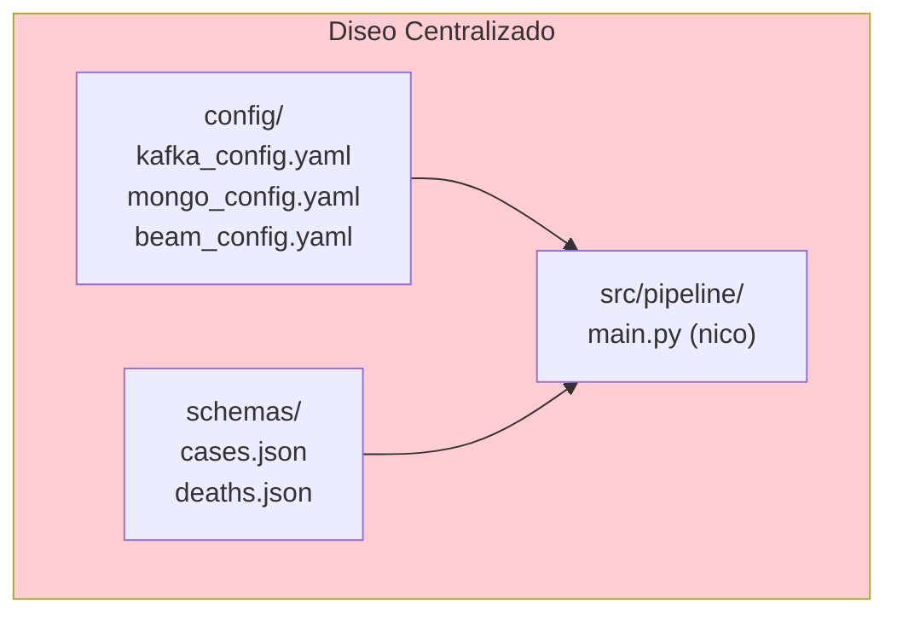

**Problemas:**
- Un solo pipeline procesa todos los schemas
- Configuracin compartida entre schemas
- Difcil personalizar por schema
- Ejecutar un schema requiere el cdigo de todos
- No hay verdadera independencia

### Diseo Actual (Independiente por Schema)

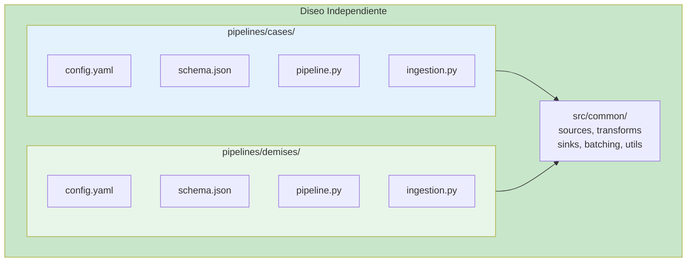

**Ventajas:**
- Cada schema es completamente independiente
- Configuracin aislada por schema
- Se pueden ejecutar en paralelo sin interferencia
- Agregar schemas no afecta los existentes
- Fcil de mantener y escalar

---

## Arquitectura Detallada

### Componentes por Schema

Cada schema tiene 4 componentes principales:

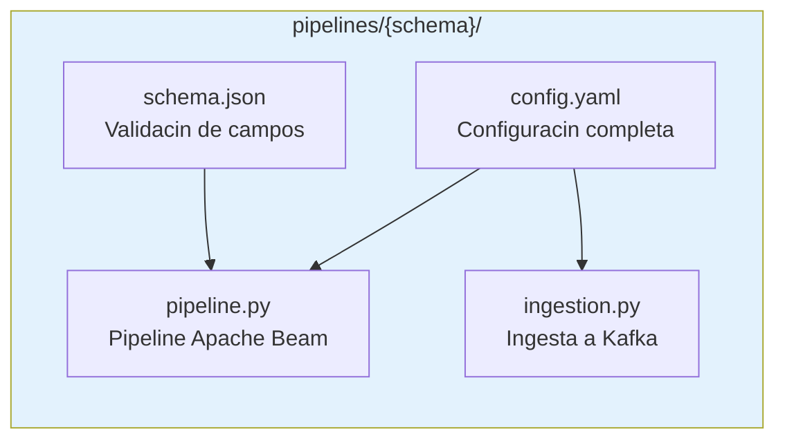

#### 1. config.yaml
```yaml
schema:
  name: "cases"

source:
  type: "kafka"
  kafka:
    topic: "cases"           # Topic exclusivo
    consumer_config:
      group.id: "beam-pipeline-cases"  # Grupo exclusivo

transforms:
  windowing:
    window_size_seconds: 60  # Ventana especfica

batching:
  strategy: "native"         # Estrategia especfica
  batch_size: 100            # Tamao especfico

sink:
  mongodb:
    collection:
      name: "cases"          # Coleccin exclusiva
```

#### 2. schema.json
Define la estructura de datos especfica del schema:
```json
{
  "schema_name": "cases",
  "required_fields": ["id", "date", "country", "cases"],
  "field_types": {
    "id": "string",
    "date": "string",
    "country": "string",
    "cases": "integer"
  }
}
```

#### 3. pipeline.py
Pipeline Apache Beam dedicado:
```python
class CasesPipeline:
    """Pipeline especfico para CASES"""

    def __init__(self):
        # Carga su propia configuracin
        self.config = self._load_config("pipelines/cases/config.yaml")

    def build(self):
        # Construye pipeline usando su configuracin
        # Totalmente independiente de otros schemas
        pass
```

#### 4. ingestion.py
Ingesta dedicada a Kafka:
```python
class CasesIngestion:
    """Ingesta especfica para CASES"""

    def run(self):
        # Lee datos de datasets/cases/
        # Enva al topic "cases"
        # Usa configuracin de pipelines/cases/config.yaml
        pass
```

### Componentes Compartidos

Los componentes en `src/common/` son libreras reutilizables sin configuracin:

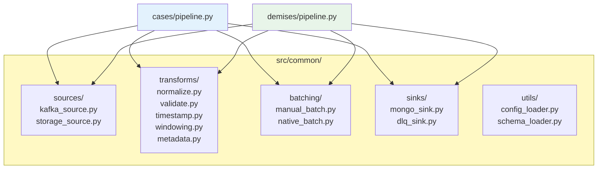

Estos componentes son invocados por cada pipeline con SU propia configuracin.

---

## Flujo de Datos por Schema

```mermaid
flowchart TB
    subgraph CasesFlow["Schema CASES"]
        CC_CSV["datasets/cases/*.csv"] --> CC_Ing["Ingestion\ncases/ingestion.py"]
        CC_Ing --> CC_Kafka["Kafka Topic: cases"]
        CC_Kafka --> CC_Pipe["Pipeline\ncases/pipeline.py"]
        CC_Pipe --> CC_Trans["Transforms\nWindow: 60s\nBatch: native, 100"]
        CC_Trans --> CC_Mongo["MongoDB: cases"]
    end

    subgraph DemisesFlow["Schema DEMISES (En Paralelo)"]
        DC_CSV["datasets/demises/*.csv"] --> DC_Ing["Ingestion\ndemises/ingestion.py"]
        DC_Ing --> DC_Kafka["Kafka Topic: demises"]
        DC_Kafka --> DC_Pipe["Pipeline\ndemises/pipeline.py"]
        DC_Pipe --> DC_Trans["Transforms\nWindow: 120s\nBatch: manual, 50"]
        DC_Trans --> DC_Mongo["MongoDB: demises"]
    end

    style CasesFlow fill:#e3f2fd
    style DemisesFlow fill:#e8f5e9
```

**Nota**: Ambos pipelines corren simultneamente sin afectarse.

---

## Orquestacin

El `orchestrator.py` descubre y gestiona schemas automticamente:

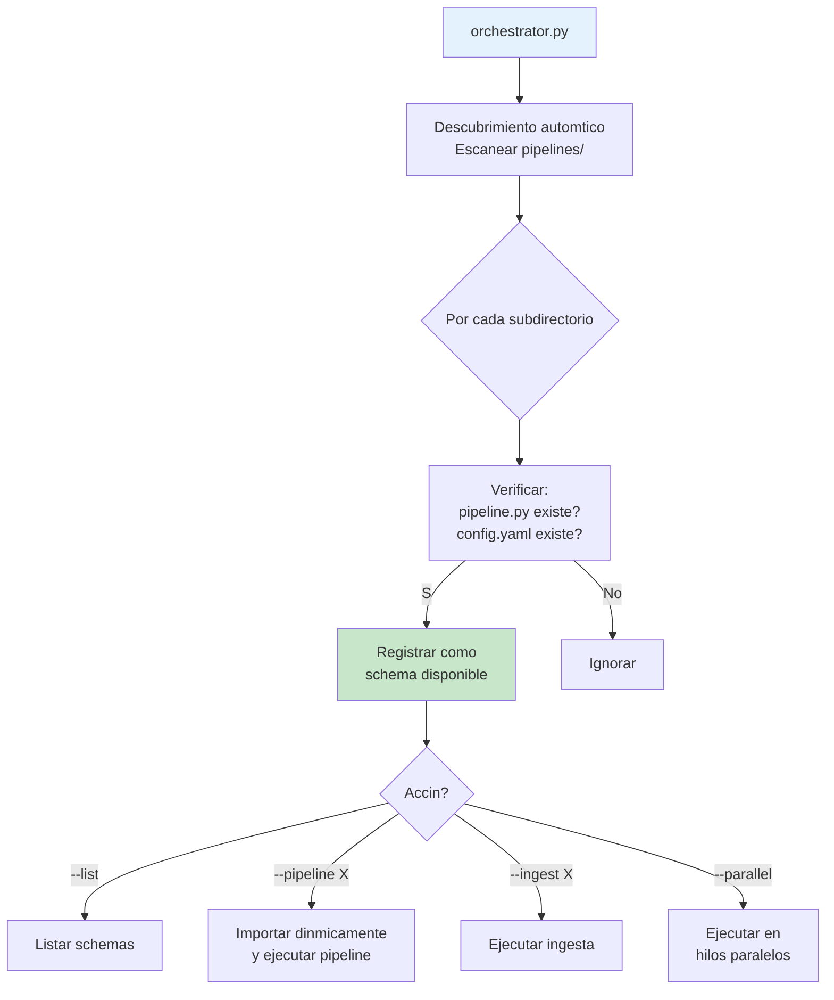

```python
# Descubrimiento automtico
orchestrator = PipelineOrchestrator()
orchestrator.available_schemas  # ['cases', 'demises', ...]

# Ejecucin individual
orchestrator.run_pipeline('cases')

# Ejecucin paralela
orchestrator.run_multiple_pipelines(['cases', 'demises'], parallel=True)
```

### Proceso de Descubrimiento

1. Escanea directorio `pipelines/`
2. Por cada subdirectorio:
   - Verifica existencia de `pipeline.py`
   - Verifica existencia de `config.yaml`
   - Lo registra como schema disponible
3. Importa dinmicamente el mdulo cuando se necesita

---

## Despliegue y Escalamiento

### Despliegue por Schema

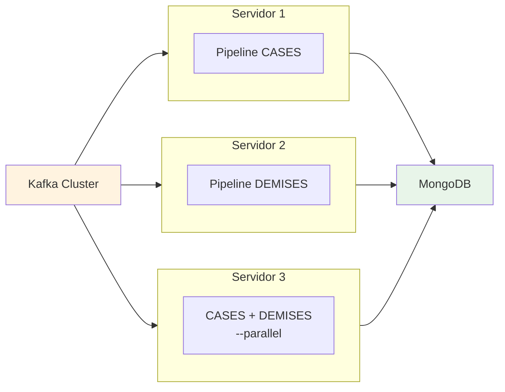

Cada schema puede desplegarse independientemente:

```bash
# Servidor 1: Solo CASES
python orchestrator.py --pipeline cases

# Servidor 2: Solo DEMISES
python orchestrator.py --pipeline demises

# Servidor 3: Ambos en paralelo
python orchestrator.py --pipeline cases demises --parallel
```

### Escalamiento Horizontal

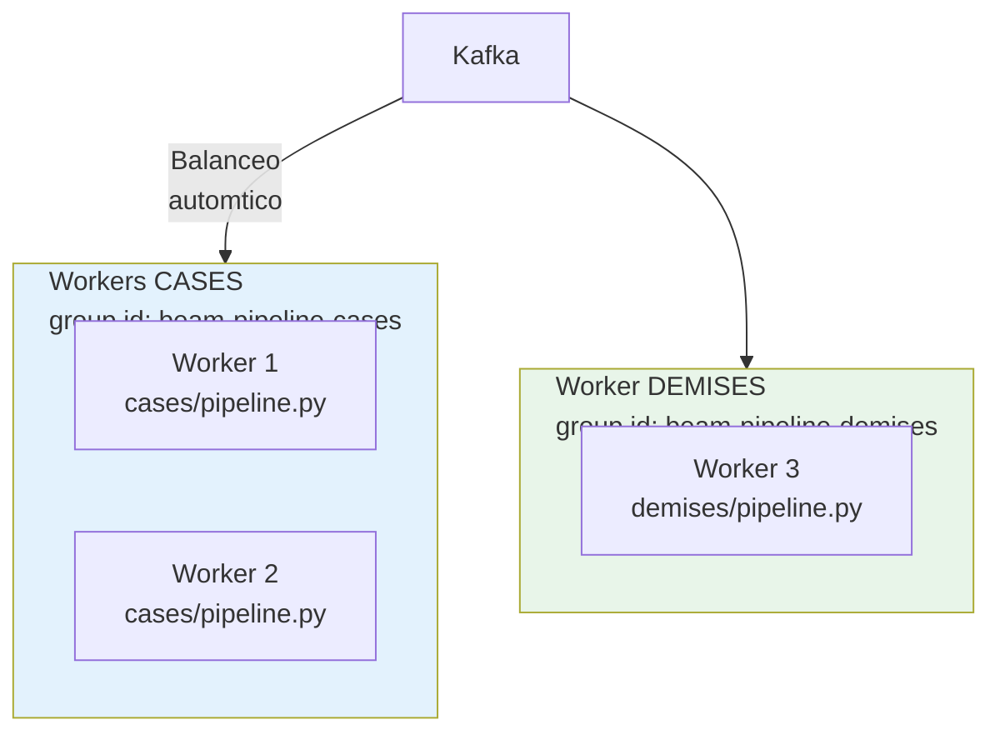

```bash
# Worker 1: Procesa CASES con group.id=beam-pipeline-cases
python pipelines/cases/pipeline.py --mode streaming

# Worker 2: Procesa CASES con el MISMO group.id (escala horizontalmente)
python pipelines/cases/pipeline.py --mode streaming

# Worker 3: Procesa DEMISES independientemente
python pipelines/demises/pipeline.py --mode streaming
```

Kafka maneja el balanceo de carga entre workers del mismo consumer group.

### Configuracin por Ambiente

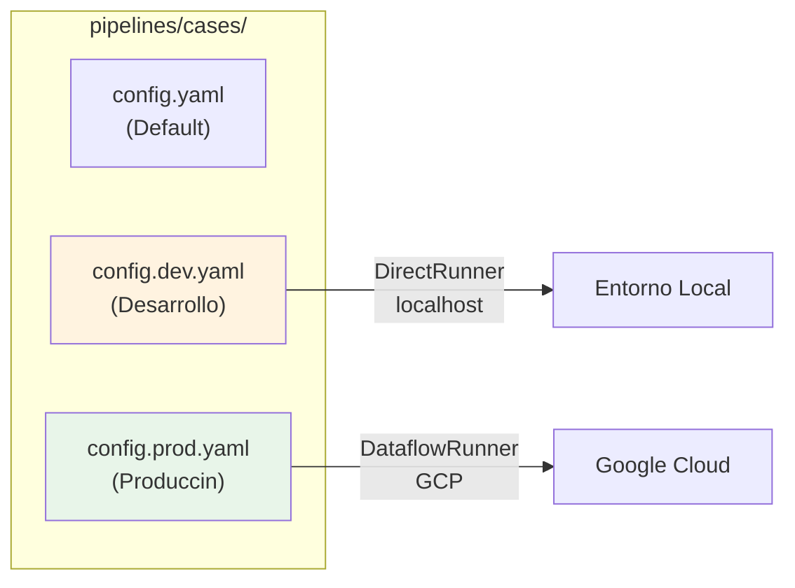

```python
# Cargar configuracin especfica
pipeline = CasesPipeline(config_path="pipelines/cases/config.prod.yaml")
```

---

## Testing por Schema

Cada schema se prueba independientemente:

```
tests/
  pipelines/
    test_cases_pipeline.py       # Tests solo para cases
    test_demises_pipeline.py     # Tests solo para demises
```

```python
# test_cases_pipeline.py
def test_cases_pipeline():
    pipeline = CasesPipeline()
    # Test especfico de cases
    ...

# test_demises_pipeline.py
def test_demises_pipeline():
    pipeline = DemisesPipeline()
    # Test especfico de demises
    ...
```

---

## Monitoreo por Schema

Cada schema tiene sus propias mtricas:

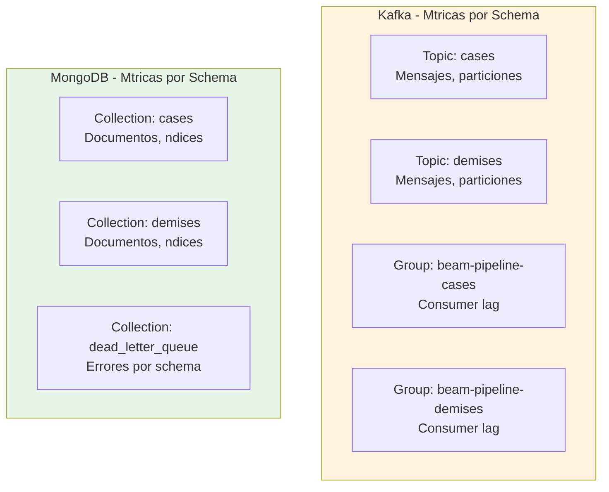

### Dead Letter Queue
```javascript
// Errores por schema
db.dead_letter_queue.aggregate([
  {$group: {
    _id: "$schema",
    count: {$sum: 1}
  }}
])
// Resultado:
// { _id: "cases", count: 5 }
// { _id: "demises", count: 2 }
```

---

## Ventajas de Independencia

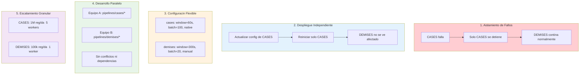

---

## Agregar Nuevo Schema: Paso a Paso

```bash
# 1. Crear estructura
mkdir -p pipelines/recovered
mkdir -p datasets/recovered

# 2. Copiar plantilla
cp pipelines/cases/* pipelines/recovered/

# 3. Editar config.yaml
# Cambiar: name, topic, group.id, collection

# 4. Editar schema.json
# Definir campos del schema

# 5. Editar pipeline.py
# Cambiar: CasesPipeline  RecoveredPipeline

# 6. Editar ingestion.py
# Cambiar: CasesIngestion  RecoveredIngestion

# 7. Agregar datos
cp mi_data.csv datasets/recovered/

# 8. Ejecutar
python orchestrator.py --ingest recovered
python orchestrator.py --pipeline recovered

# 9. El orquestador lo descubre automticamente
python orchestrator.py --list
# Output:
#   cases
#   demises
#   recovered  <-- Nuevo schema!
```

---

## Conclusin

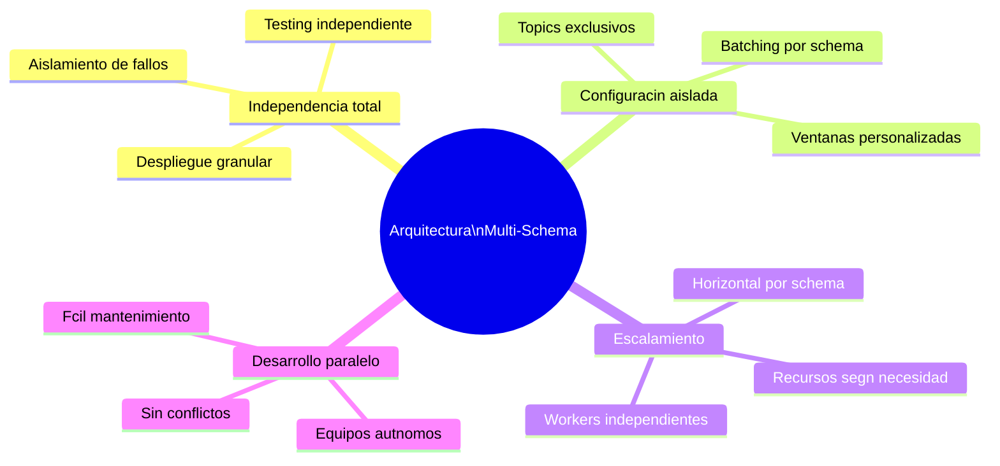

Esta arquitectura proporciona independencia total entre schemas, configuracin aislada y personalizable, ejecucin paralela sin interferencia, escalamiento granular por schema, facilidad para agregar nuevos schemas, testing y despliegue independiente, y monitoreo especfico por schema.

Es la arquitectura ideal para sistemas multi-tenant o procesamiento de mltiples tipos de datos.
