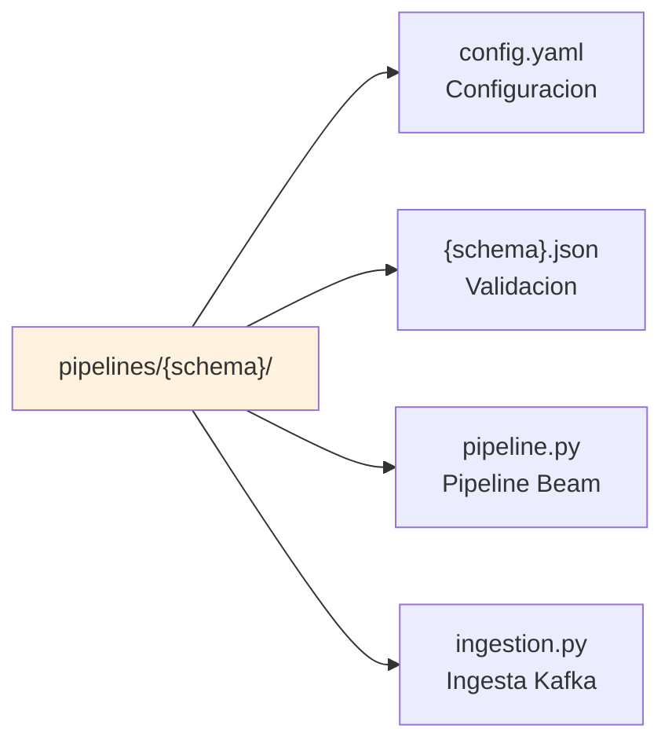
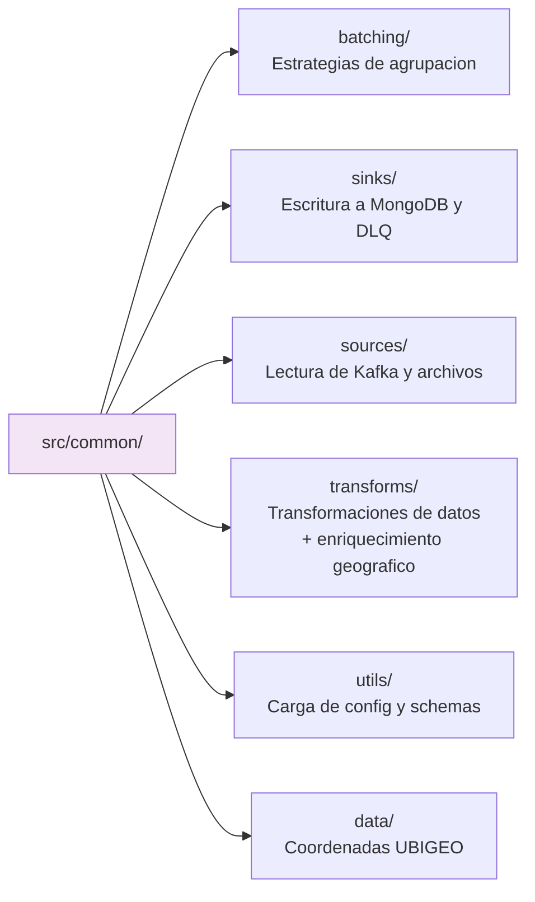

# Estructura Limpia del Proyecto

## Estructura Final

```mermaid
flowchart TB
    Root["tfm-dataflow-architecture/"] --> Pipelines["pipelines/\nPipelines independientes por schema"]
    Root --> Src["src/\nCodigo fuente"]
    Root --> Datasets["datasets/\nDatos por schema"]
    Root --> Viz["visualization/\nDashboard tiempo real"]
    Root --> Scripts["Scripts y configuracion"]
    Root --> Docs["Documentacion"]

    subgraph PipelinesDetail["Pipelines"]
        Pipelines --> Cases["cases/\nconfig.yaml\ncases.json\npipeline.py\ningestion.py"]
        Pipelines --> Demises["demises/\nconfig.yaml\ndemises.json\npipeline.py\ningestion.py"]
        Pipelines --> Hospitals["hospitalizations/\nconfig.yaml\nhospitalizations.json\npipeline.py\ningestion.py"]
    end

    subgraph SrcDetail["Source Code"]
        Src --> Common["common/"]
        Common --> Batching["batching/\nmanual_batch.py\nnative_batch.py"]
        Common --> Sinks["sinks/\nmongo_sink.py\ndlq_sink.py"]
        Common --> Sources["sources/\nkafka_source_native.py\nstorage_source.py"]
        Common --> Transforms["transforms/\nmetadata.py, normalize.py\ntimestamp.py, validate.py\nwindowing.py, enrich_geo.py"]
        Common --> Utils["utils/\nconfig_loader.py\nschema_loader.py"]
        Common --> Data["data/\nubigeo_coords.py"]
        Src --> Ingestion["ingestion/\nkafka_processor.py"]
    end

    subgraph DatasetsDetail["Datos"]
        Datasets --> DCases["cases/\n13 archivos CSV"]
        Datasets --> DDemises["demises/\n13 archivos CSV"]
        Datasets --> DHosp["hospitalizations/\n13 archivos CSV"]
    end

    subgraph VizDetail["Visualizacion"]
        Viz --> VizApp["Flask + Socket.IO\nD3.js + Leaflet\nPort: 5006"]
    end

    subgraph ScriptsDetail["Scripts"]
        Scripts --> Orch["orchestrator.py"]
        Scripts --> ExRun["example_run_all.sh"]
        Scripts --> RunC["run_cases.sh"]
        Scripts --> RunD["run_deaths.sh"]
        Scripts --> DockerF["docker-compose.yaml"]
        Scripts --> Reqs["requirements.txt"]
    end

    subgraph DocsDetail["Documentacion"]
        Docs --> README["README.md"]
        Docs --> RMNEW["README_NEW.md"]
        Docs --> ARCH["ARCHITECTURE.md"]
        Docs --> QS["QUICKSTART.md"]
        Docs --> EP["ESTRUCTURA_PROYECTO.md"]
        Docs --> GNS["GUIA_NUEVO_SCHEMA.md"]
    end

    style Root fill:#e3f2fd
    style Pipelines fill:#fff3e0
    style Src fill:#f3e5f5
    style Datasets fill:#e8f5e9
    style Viz fill:#e0f7fa
    style Scripts fill:#fff9c4
    style Docs fill:#e0f2f1
```



---

## Proposito de Cada Carpeta

### `pipelines/`



Cada subdirectorio es un **schema independiente** con:
- Su propia configuracion
- Su propio pipeline
- Su propia ingesta
- Su propio schema de validacion

**Schemas actuales:** cases, demises, hospitalizations

**Agregar nuevo schema**: Copiar `pipelines/cases/` y editar.

### `src/common/`



Componentes **reutilizables sin configuracion**.
**No contiene logica de negocio especifica de schemas.**

### `src/ingestion/`
`kafka_processor.py`: Clase comun para leer CSV/Parquet y enviar a Kafka usando confluent_kafka y Polars.
Usado por todos los `pipelines/*/ingestion.py`.

### `datasets/`
Datos de entrada organizados por schema (39 archivos CSV total):
- `datasets/cases/` - 13 archivos CSV (file_0_cases.csv a file_12_cases.csv)
- `datasets/demises/` - 13 archivos CSV (file_0_demises.csv a file_12_demises.csv)
- `datasets/hospitalizations/` - 13 archivos CSV (file_0_hospital.csv a file_12_hospital.csv)

### `visualization/`
Dashboard en tiempo real con Flask + Socket.IO + D3.js + Leaflet.
- 9 visualizaciones (barras, area, donut, piramide, mapas de calor)
- Actualizacion en tiempo real via WebSockets
- Acceso en http://localhost:5006

---

## Comandos Principales

```bash
# Listar schemas disponibles
python orchestrator.py --list

# Ejecutar pipeline individual
python orchestrator.py --pipeline cases
python orchestrator.py --pipeline demises
python orchestrator.py --pipeline hospitalizations

# Ejecutar multiples en paralelo
python orchestrator.py --pipeline cases demises hospitalizations --parallel

# Ingestar datos
python orchestrator.py --ingest cases
python orchestrator.py --ingest-all --parallel

# Scripts rapidos
./run_cases.sh both
./run_deaths.sh both

# Demo completa
./example_run_all.sh

# Dashboard
cd visualization && python app.py
```

---

## Total de Archivos por Tipo

| Tipo | Cantidad | Detalle |
|------|----------|---------|
| Pipelines por schema | 12 | 3 schemas x 4 archivos |
| Componentes comunes | 15 | Archivos Python en src/ |
| Datos de referencia | 1 | ubigeo_coords.py |
| Datasets | 39 | Archivos CSV (13 por schema) |
| Visualizacion | ~20 | Flask + D3.js + Leaflet |
| Scripts orquestacion | 5 | .py + .sh |
| Documentacion | 8 | Archivos Markdown + TXT |
| Docker | 1 | docker-compose.yaml |
| Python deps | 1 | requirements.txt |
| **Total** | **~100** | Sin contar `__init__.py` |

---

## Imports Correctos

```python
# Sources
from src.common.sources.kafka_source_native import KafkaConsumerDoFn
from src.common.sources.storage_source import ReadCSVFiles

# Transforms
from src.common.transforms.normalize import NormalizeRecord
from src.common.transforms.enrich_geo import EnrichGeoFromUbigeo
from src.common.transforms.validate import ValidateSchema
from src.common.transforms.timestamp import AssignTimestamp
from src.common.transforms.windowing import create_windowing_transform
from src.common.transforms.metadata import AddMetadata

# Batching
from src.common.batching.native_batch import NativeBatcher
from src.common.batching.manual_batch import GroupIntoBatches

# Sinks
from src.common.sinks.mongo_sink import MongoDBSink
from src.common.sinks.dlq_sink import DLQSink

# Utils
from src.common.utils.config_loader import ConfigLoader
from src.common.utils.schema_loader import SchemaLoader

# Data
from src.common.data.ubigeo_coords import ubigeo_coords

# Ingestion
from src.ingestion.kafka_processor import KafkaProcessor
```

---

**Ultima actualizacion:** 2026-02-10
