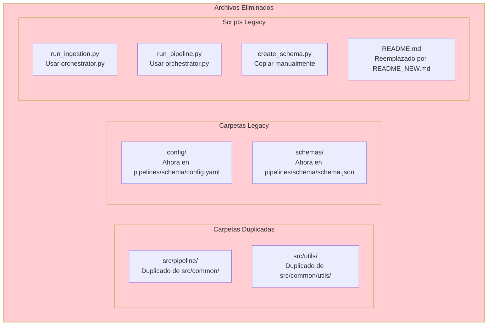
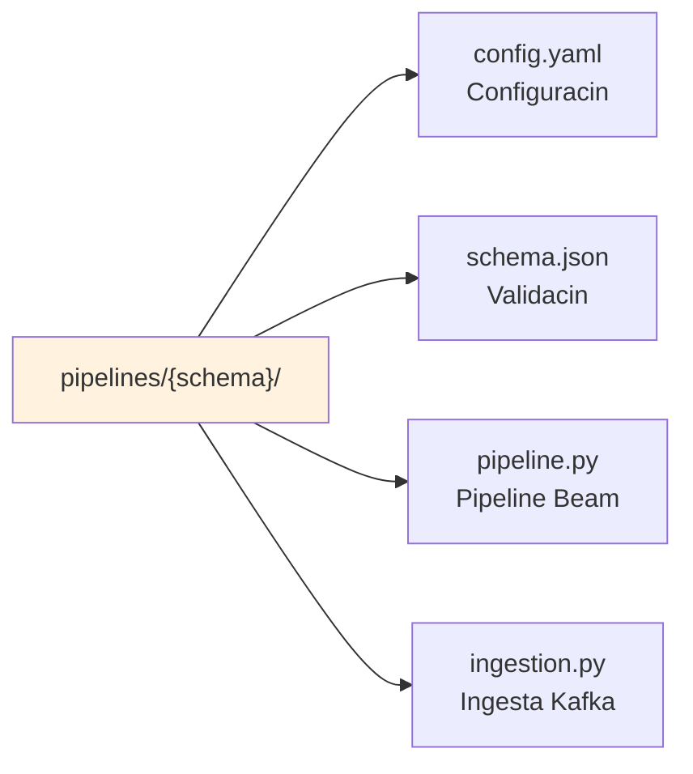
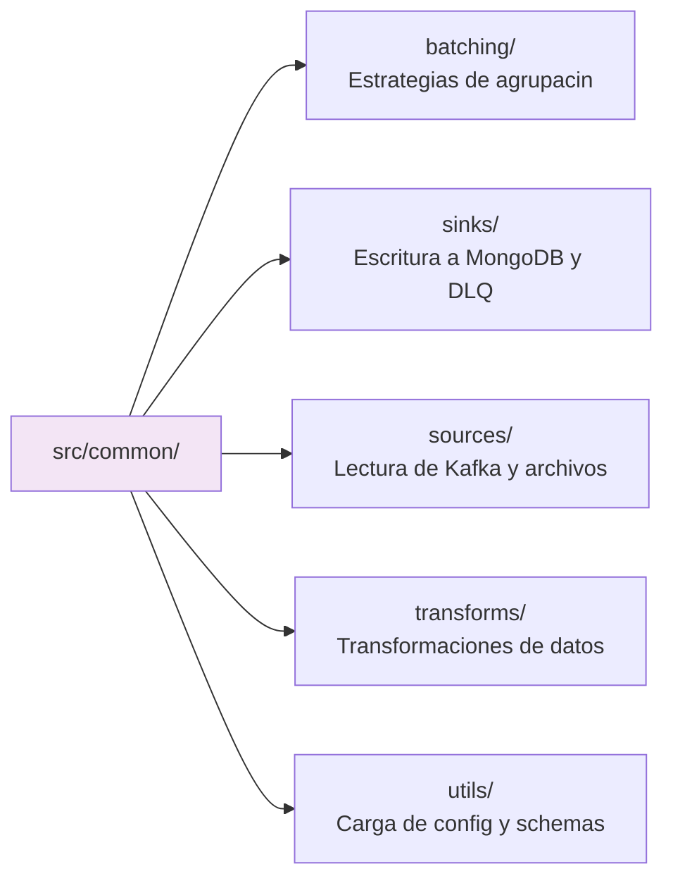
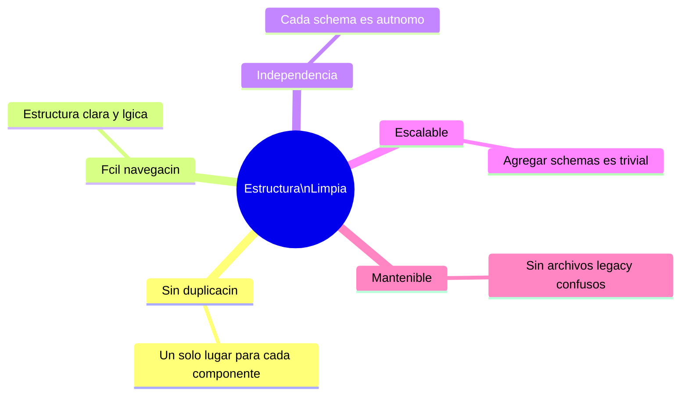

# Estructura Limpia del Proyecto

## Estructura Final

```mermaid
flowchart TB
    Root["tfm/"] --> Pipelines["pipelines/\nPipelines independientes por schema"]
    Root --> Src["src/\nCdigo fuente"]
    Root --> Datasets["datasets/\nDatos por schema"]
    Root --> Scripts["Scripts y configuracin"]
    Root --> Docs["Documentacin"]

    subgraph PipelinesDetail["Pipelines"]
        Pipelines --> Cases["cases/\nconfig.yaml\nschema.json\npipeline.py\ningestion.py"]
        Pipelines --> Demises["demises/\nconfig.yaml\nschema.json\npipeline.py\ningestion.py"]
    end

    subgraph SrcDetail["Source Code"]
        Src --> Common["common/"]
        Common --> Batching["batching/\nmanual_batch.py\nnative_batch.py"]
        Common --> Sinks["sinks/\nmongo_sink.py\ndlq_sink.py"]
        Common --> Sources["sources/\nkafka_source.py\nstorage_source.py"]
        Common --> Transforms["transforms/\nmetadata.py, normalize.py\ntimestamp.py, validate.py\nwindowing.py"]
        Common --> Utils["utils/\nconfig_loader.py\nschema_loader.py"]
        Src --> Ingestion["ingestion/\nkafka_processor.py"]
    end

    subgraph DatasetsDetail["Datos"]
        Datasets --> DCases["cases/\nsample_data.csv"]
        Datasets --> DDemises["demises/\nsample_data.csv"]
    end

    subgraph ScriptsDetail["Scripts"]
        Scripts --> Orch["orchestrator.py"]
        Scripts --> ExRun["example_run_all.sh"]
        Scripts --> RunC["run_cases.sh"]
        Scripts --> RunD["run_demises.sh"]
        Scripts --> DockerF["docker-compose.yaml"]
        Scripts --> Reqs["requirements.txt"]
    end

    subgraph DocsDetail["Documentacin"]
        Docs --> RMNEW["README_NEW.md"]
        Docs --> ARCH["ARCHITECTURE.md"]
        Docs --> QS["QUICKSTART.md"]
        Docs --> EP["ESTRUCTURA_PROYECTO.md"]
    end

    style Root fill:#e3f2fd
    style Pipelines fill:#fff3e0
    style Src fill:#f3e5f5
    style Datasets fill:#e8f5e9
    style Scripts fill:#fff9c4
    style Docs fill:#e0f2f1
```



---

## Archivos Eliminados (ya no necesarios)



---

## Propsito de Cada Carpeta

### `pipelines/`



Cada subdirectorio es un **schema independiente** con:
- Su propia configuracin
- Su propio pipeline
- Su propia ingesta
- Su propio schema de validacin

**Agregar nuevo schema**: Copiar `pipelines/cases/` y editar.

### `src/common/`



Componentes **reutilizables sin configuracin**.
**No contiene lgica de negocio especfica de schemas.**

### `src/ingestion/`
`kafka_processor.py`: Clase comn para leer CSV/Parquet y enviar a Kafka usando Polars.
Usado por todos los `pipelines/*/ingestion.py`.

### `datasets/`
Datos de entrada organizados por schema:
- `datasets/cases/` - CSV/Parquet para CASES
- `datasets/demises/` - CSV/Parquet para DEMISES

---

## Comandos Principales

```bash
# Listar schemas disponibles
python orchestrator.py --list

# Ejecutar pipeline individual
python orchestrator.py --pipeline cases
python orchestrator.py --pipeline demises

# Ejecutar mltiples en paralelo
python orchestrator.py --pipeline cases demises --parallel

# Ingestar datos
python orchestrator.py --ingest cases
python orchestrator.py --ingest-all --parallel

# Scripts rpidos
./run_cases.sh both
./run_demises.sh both

# Demo completa
./example_run_all.sh
```

---

## Total de Archivos por Tipo

| Tipo | Cantidad | Detalle |
|------|----------|---------|
| Pipelines por schema | 8 | 2 schemas x 4 archivos |
| Componentes comunes | 14 | Archivos Python en src/ |
| Datasets | 2 | Archivos CSV de ejemplo |
| Scripts orquestacin | 4 | .py + .sh |
| Documentacin | 4 | Archivos Markdown |
| Docker | 1 | docker-compose.yaml |
| Python deps | 1 | requirements.txt |
| **Total** | **~35** | Sin contar `__init__.py` |

---

## Ventajas de la Estructura Limpia



---

## Migracin de Cdigo Antiguo

Si tienes cdigo que usaba la estructura antigua:

```python
# ANTES (ya no funciona)
from src.utils.config_loader import ConfigLoader
from src.pipeline.transforms.normalize import NormalizeRecord

# AHORA (correcto)
from src.common.utils.config_loader import ConfigLoader
from src.common.transforms.normalize import NormalizeRecord
```

Los pipelines individuales ya estn actualizados para usar `src.common.*`.
