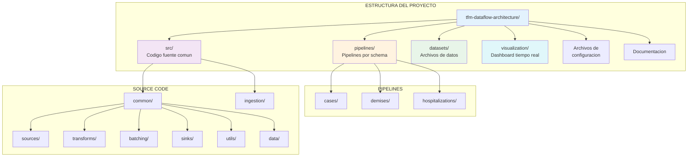
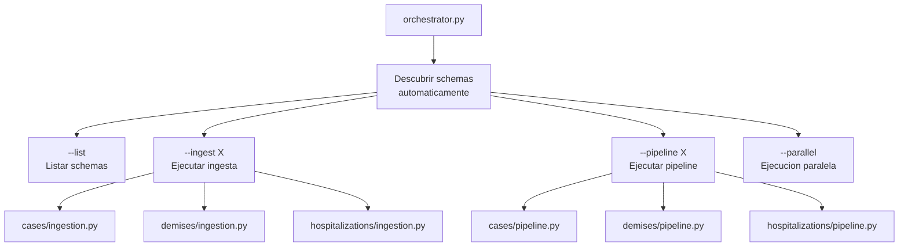
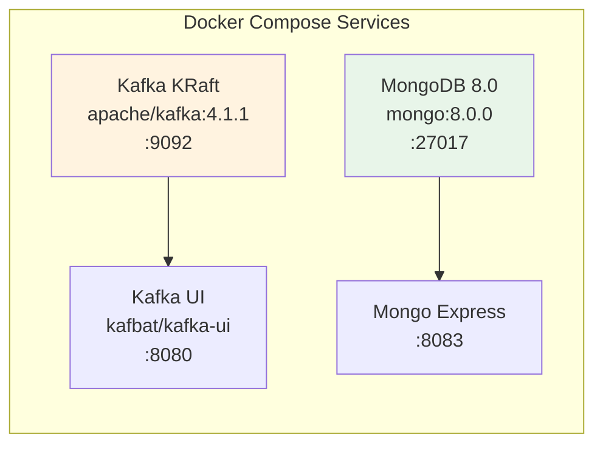
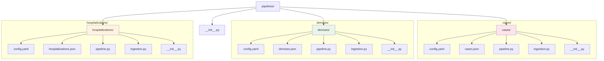
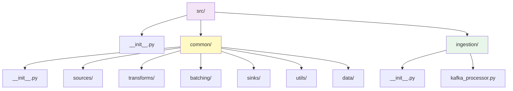
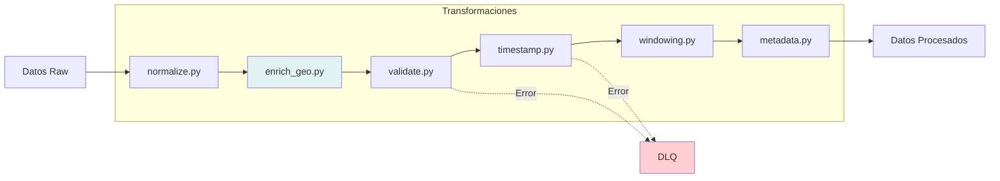

# Estructura del Proyecto - Documentacion Detallada

Este documento describe cada carpeta y archivo del proyecto, explicando su funcionalidad y como interactuan entre si.

---

## Tabla de Contenidos

1. [Vista General](#vista-general)
2. [Carpeta Raiz](#carpeta-raiz)
3. [Carpeta pipelines/](#carpeta-pipelines)
4. [Carpeta src/](#carpeta-src)
5. [Carpeta datasets/](#carpeta-datasets)
6. [Carpeta visualization/](#carpeta-visualization)
7. [Diagrama de Dependencias](#diagrama-de-dependencias)
8. [Resumen de Componentes](#resumen-de-componentes)

---

## Vista General



---

## Carpeta Raiz

### Archivos de Configuracion y Ejecucion

| Archivo | Tipo | Descripcion |
|---------|------|-------------|
| `docker-compose.yaml` | Configuracion | Servicios Docker: Kafka KRaft, MongoDB 8.0, Kafka UI, Mongo Express |
| `requirements.txt` | Dependencias | Paquetes Python: apache-beam, confluent-kafka, pymongo, polars, pyyaml |
| `orchestrator.py` | Python | **Orquestador central** - Descubre y ejecuta pipelines de multiples schemas |

### Scripts de Ejecucion

| Archivo | Descripcion |
|---------|-------------|
| `run_cases.sh` | Script bash para ejecutar el pipeline de CASES (opciones: ingest/pipeline/both) |
| `run_deaths.sh` | Script bash para ejecutar el pipeline de DEMISES |
| `example_run_all.sh` | Ejemplo de ejecucion de todos los pipelines en paralelo |
| `verify_structure.sh` | Verifica que la estructura del proyecto este correcta |

### Documentacion

| Archivo | Descripcion |
|---------|-------------|
| `README.md` | Documentacion principal con diagramas Mermaid |
| `README_NEW.md` | Documentacion multi-schema |
| `ARCHITECTURE.md` | Documentacion de arquitectura tecnica |
| `QUICKSTART.md` | Guia rapida de inicio |
| `GUIA_NUEVO_SCHEMA.md` | Guia paso a paso para agregar nuevos schemas |
| `ESTRUCTURA_PROYECTO.md` | Este archivo - Documentacion de estructura |
| `ESTRUCTURA_LIMPIA.md` | Estructura limpia del proyecto |
| `PROJECT_STRUCTURE.txt` | Estructura en formato texto |
| `pendientes.md` | Tareas pendientes |

---

### Detalle: `orchestrator.py`

El orquestador es el punto de entrada principal para ejecutar pipelines.



**Funcionalidades principales:**

```python
class PipelineOrchestrator:
    def _discover_schemas()    # Auto-descubre schemas en pipelines/
    def list_schemas()         # Lista schemas disponibles
    def run_ingest()           # Ejecuta ingesta de un schema
    def run_pipeline()         # Ejecuta pipeline de un schema
    def run_multiple_pipelines()  # Ejecuta multiples schemas en paralelo
    def run_multiple_ingestions() # Ejecuta multiples ingestas en paralelo
```

**Comandos disponibles:**

```bash
python orchestrator.py --list
python orchestrator.py --ingest cases
python orchestrator.py --ingest-all --parallel
python orchestrator.py --pipeline cases
python orchestrator.py --pipeline-all --parallel
python orchestrator.py --pipeline cases demises hospitalizations --parallel
python orchestrator.py --ingest cases --file datasets/cases/file_0_cases.csv
```

---

### Detalle: `docker-compose.yaml`

Define los servicios de infraestructura. Usa **Kafka KRaft** (sin Zookeeper).



| Servicio | Puerto | Imagen | Descripcion |
|----------|--------|--------|-------------|
| Kafka KRaft | 9092 | apache/kafka:4.1.1 | Message broker (modo KRaft, sin Zookeeper) |
| MongoDB | 27017 | mongo:8.0.0 | Base de datos time-series (admin/admin123) |
| Kafka UI | 8080 | kafbat/kafka-ui | Interface web para monitorear Kafka |
| Mongo Express | 8083 | mongo-express | Interface web para MongoDB |

---

## Carpeta `pipelines/`

Contiene los **pipelines especificos por schema**. Cada schema es completamente independiente.



---

### `pipelines/cases/` - Schema de Casos COVID-19

| Archivo | Tipo | Descripcion |
|---------|------|-------------|
| `config.yaml` | Configuracion | Configuracion completa del pipeline |
| `cases.json` | Schema | Definicion de campos y validacion |
| `pipeline.py` | Python | Clase `CasesPipeline` - Pipeline Apache Beam |
| `ingestion.py` | Python | Clase `CasesIngestion` - Ingesta de datos |
| `__init__.py` | Python | Hace la carpeta un modulo importable |

**Campos requeridos:** `fecha_muestra`, `edad`, `sexo`, `resultado`

**Timestamp field:** `fecha_muestra`

---

### `pipelines/demises/` - Schema de Fallecimientos

| Archivo | Tipo | Descripcion |
|---------|------|-------------|
| `config.yaml` | Configuracion | Configuracion completa del pipeline |
| `demises.json` | Schema | Definicion de campos y validacion |
| `pipeline.py` | Python | Clase `DemisesPipeline` - Pipeline Apache Beam |
| `ingestion.py` | Python | Clase `DemisesIngestion` - Ingesta de datos |
| `__init__.py` | Python | Hace la carpeta un modulo importable |

**Campos requeridos:** `fecha_fallecimiento`, `edad_declarada`, `sexo`, `clasificacion_def`

**Timestamp field:** `fecha_fallecimiento`

---

### `pipelines/hospitalizations/` - Schema de Hospitalizaciones

| Archivo | Tipo | Descripcion |
|---------|------|-------------|
| `config.yaml` | Configuracion | Configuracion completa del pipeline |
| `hospitalizations.json` | Schema | Definicion de campos y validacion (54 campos) |
| `pipeline.py` | Python | Clase `HospitalizationsPipeline` - Pipeline Apache Beam |
| `ingestion.py` | Python | Clase `HospitalizationsIngestion` - Ingesta de datos |
| `__init__.py` | Python | Hace la carpeta un modulo importable |

**Campos requeridos:** `id_persona`, `sexo`, `fecha_ingreso_hosp`, `edad`

**Timestamp field:** `fecha_ingreso_hosp`

**Campos adicionales:** vacunacion (6 dosis), UCI, ventilacion mecanica, oxigeno, datos de establecimiento de salud

---

### Comparacion de Schemas

| Parametro | CASES | DEMISES | HOSPITALIZATIONS |
|-----------|-------|---------|------------------|
| `timestamp field` | fecha_muestra | fecha_fallecimiento | fecha_ingreso_hosp |
| `required_fields` | 4 | 4 | 4 |
| `total fields` | ~15 | ~9 | ~54 |
| `topic` | cases | demises | hospitalizations |
| `collection` | cases | demises | hospitalizations |
| `window_size_seconds` | 60 | 60 | 60 |
| `batch_size` | 100 | 100 | 100 |
| `batching.strategy` | native | native | native |

---

## Carpeta `src/`

Contiene el **codigo fuente reutilizable** compartido entre todos los schemas.



---

### `src/ingestion/kafka_processor.py`

Clase que lee archivos CSV/Parquet y envia mensajes a Kafka usando **confluent_kafka**.

```python
class KafkaProcessor:
    """Procesa archivos y los envia a Kafka"""

    def __init__(self, bootstrap_servers: str, producer_config: dict):
        self.producer = Producer(config)
        self.admin_client = AdminClient(config)

    def ensure_topic_exists(self, topic_name: str):
        # Crea el topic si no existe

    def process_csv(self, file_path: str, topic: str, schema_name: str):
        # Lee CSV con Polars y envia a Kafka

    def process_parquet(self, file_path: str, topic: str, schema_name: str):
        # Lee Parquet y envia a Kafka

    def process_directory(self, directory: str, topic: str, schema_name: str):
        # Procesa todos los archivos de un directorio
```

### `src/common/sources/kafka_source_native.py`

Consumer nativo de Kafka usando confluent_kafka (no Docker):

```python
class KafkaConsumerDoFn(beam.DoFn):
    """Lee mensajes de Kafka usando confluent_kafka nativo"""
    # Consume mensajes del topic configurado
    # Retorna tagged outputs: 'main' y 'dlq'
```

### `src/common/sources/storage_source.py`

Lee archivos directamente sin pasar por Kafka:

```python
class ReadCSVFiles:  # Lee archivos CSV con Polars
class ReadParquetFiles:  # Lee archivos Parquet
```

### `src/common/transforms/`



| Transform | Archivo | Descripcion |
|-----------|---------|-------------|
| Normalize | `normalize.py` | Maneja nulls, convierte tipos, estandariza formatos |
| Enrich Geo | `enrich_geo.py` | Convierte UBIGEO a coordenadas lat/lon |
| Validate | `validate.py` | Valida contra schema JSON |
| Timestamp | `timestamp.py` | Asigna timestamps (YYYYMMDD o Unix) |
| Windowing | `windowing.py` | Ventanas temporales fijas con allowed_lateness |
| Metadata | `metadata.py` | Agrega pipeline_version, source_type, processed_at |

### `src/common/data/ubigeo_coords.py`

Diccionario de coordenadas geograficas para distritos peruanos basado en codigos UBIGEO.

### `src/common/batching/`

| Archivo | Descripcion |
|---------|-------------|
| `native_batch.py` | Batching nativo de Apache Beam (BatchElements) |
| `manual_batch.py` | Batching manual con control total (GroupIntoBatches) |

### `src/common/sinks/`

| Archivo | Descripcion |
|---------|-------------|
| `mongo_sink.py` | Escribe a MongoDB (bulk write, time-series, auto-create collection) |
| `dlq_sink.py` | Escribe errores a Dead Letter Queue con indices |

### `src/common/utils/`

| Archivo | Descripcion |
|---------|-------------|
| `config_loader.py` | Carga configuracion YAML |
| `schema_loader.py` | Carga y valida schemas JSON |

---

## Carpeta `datasets/`

Contiene los archivos de datos organizados por schema. **39 archivos CSV en total.**

```
datasets/
|-- cases/
|   |-- file_0_cases.csv
|   |-- file_1_cases.csv
|   |-- ... (13 archivos)
|   +-- file_12_cases.csv
|-- demises/
|   |-- file_0_demises.csv
|   |-- ... (13 archivos)
|   +-- file_12_demises.csv
+-- hospitalizations/
    |-- file_0_hospital.csv
    |-- ... (13 archivos)
    +-- file_12_hospital.csv
```

---

## Carpeta `visualization/`

Dashboard interactivo en tiempo real con Flask + Socket.IO + D3.js + Leaflet.

```
visualization/
|-- app.py                    # Servidor Flask + Socket.IO + Polling
|-- config.py                 # Configuracion (MongoDB, puertos, coords)
|-- services/database.py      # Cliente PyMongo
|-- routes/api.py             # 14 endpoints REST
|-- handlers/
|   |-- alerts.py             # Sistema de alertas por umbral
|   |-- queries/              # Queries MongoDB (cases, demises, hospitalizations, summary)
|   +-- websocket/events.py   # 15+ handlers WebSocket
|-- static/
|   |-- css/style.css         # Tema oscuro responsive
|   +-- js/
|       |-- main.js           # Entry point, conexion SocketIO
|       |-- charts/           # D3.js: department, timeline, age, sex, heatmaps
|       +-- modules/          # alerts, filters, config, utils
+-- templates/index.html      # SPA con todas las visualizaciones
```

**URL:** http://localhost:5006

---

## Diagrama de Dependencias

```mermaid
graph TB
    subgraph "CAPA DE EJECUCION"
        User[Usuario] --> Orch[orchestrator.py]
        User --> Scripts[run_*.sh]
    end

    subgraph "CAPA DE PIPELINES"
        Orch --> CasesI[cases/ingestion.py]
        Orch --> CasesP[cases/pipeline.py]
        Orch --> DemisesI[demises/ingestion.py]
        Orch --> DemisesP[demises/pipeline.py]
        Orch --> HospI[hospitalizations/ingestion.py]
        Orch --> HospP[hospitalizations/pipeline.py]
    end

    subgraph "CAPA DE CONFIGURACION"
        CasesP --> CConfig[cases/config.yaml]
        CasesP --> CSchema[cases/cases.json]
        DemisesP --> DConfig[demises/config.yaml]
        DemisesP --> DSchema[demises/demises.json]
        HospP --> HConfig[hospitalizations/config.yaml]
        HospP --> HSchema[hospitalizations/hospitalizations.json]
    end

    subgraph "CAPA DE INGESTA"
        CasesI --> KProc[kafka_processor.py]
        DemisesI --> KProc
        HospI --> KProc
        KProc --> Data[datasets/*.csv]
    end

    subgraph "CAPA DE TRANSFORMACIONES"
        CasesP --> KSource[kafka_source_native.py]
        CasesP --> Norm[normalize.py]
        CasesP --> EGeo[enrich_geo.py]
        CasesP --> Val[validate.py]
        CasesP --> TS[timestamp.py]
        CasesP --> Win[windowing.py]
        CasesP --> Meta[metadata.py]
    end

    subgraph "CAPA DE SINKS"
        CasesP --> MSink[mongo_sink.py]
        CasesP --> DLQSink[dlq_sink.py]
    end

    subgraph "CAPA DE DATOS"
        EGeo --> UCoords[ubigeo_coords.py]
    end

    subgraph "INFRAESTRUCTURA"
        KProc --> Kafka[Kafka KRaft]
        KSource --> Kafka
        MSink --> MongoDB[MongoDB 8.0]
        DLQSink --> MongoDB
    end

    subgraph "VISUALIZACION"
        MongoDB --> Viz[visualization/app.py]
    end

    style Orch fill:#e3f2fd
    style CasesP fill:#f3e5f5
    style MSink fill:#e8f5e9
    style Kafka fill:#fff3e0
    style MongoDB fill:#c8e6c9
    style Viz fill:#e0f7fa
```



---

## Resumen de Componentes

| Componente | Archivo | Responsabilidad |
|------------|---------|-----------------|
| **Orquestador** | `orchestrator.py` | Descubre schemas, ejecuta ingestas y pipelines |
| **Ingesta Schema** | `pipelines/X/ingestion.py` | Lee CSV -> envia a Kafka |
| **Pipeline Schema** | `pipelines/X/pipeline.py` | Lee Kafka -> transforma -> escribe MongoDB |
| **Config Schema** | `pipelines/X/config.yaml` | Configuracion completa del pipeline |
| **Schema JSON** | `pipelines/X/{X}.json` | Definicion de campos y validacion |
| **Kafka Processor** | `src/ingestion/kafka_processor.py` | Lee archivos y produce a Kafka (confluent_kafka) |
| **Kafka Source** | `src/common/sources/kafka_source_native.py` | Consume de Kafka en Beam (confluent_kafka nativo) |
| **Storage Source** | `src/common/sources/storage_source.py` | Lee archivos directamente (Polars) |
| **Normalize** | `src/common/transforms/normalize.py` | Normaliza datos |
| **Enrich Geo** | `src/common/transforms/enrich_geo.py` | Enriquece con coordenadas lat/lon desde UBIGEO |
| **Validate** | `src/common/transforms/validate.py` | Valida contra schema |
| **Timestamp** | `src/common/transforms/timestamp.py` | Asigna timestamps |
| **Windowing** | `src/common/transforms/windowing.py` | Aplica ventanas temporales |
| **Metadata** | `src/common/transforms/metadata.py` | Agrega metadata |
| **Native Batch** | `src/common/batching/native_batch.py` | Batching automatico |
| **Manual Batch** | `src/common/batching/manual_batch.py` | Batching manual |
| **MongoDB Sink** | `src/common/sinks/mongo_sink.py` | Escribe a MongoDB |
| **DLQ Sink** | `src/common/sinks/dlq_sink.py` | Escribe errores a DLQ |
| **Config Loader** | `src/common/utils/config_loader.py` | Carga configuracion YAML |
| **Schema Loader** | `src/common/utils/schema_loader.py` | Carga y valida schemas |
| **UBIGEO Coords** | `src/common/data/ubigeo_coords.py` | Coordenadas geograficas Peru |
| **Dashboard** | `visualization/app.py` | Visualizacion en tiempo real (D3.js + Leaflet) |

---

**Ultima actualizacion:** 2026-02-10
**Version:** 2.0.0
