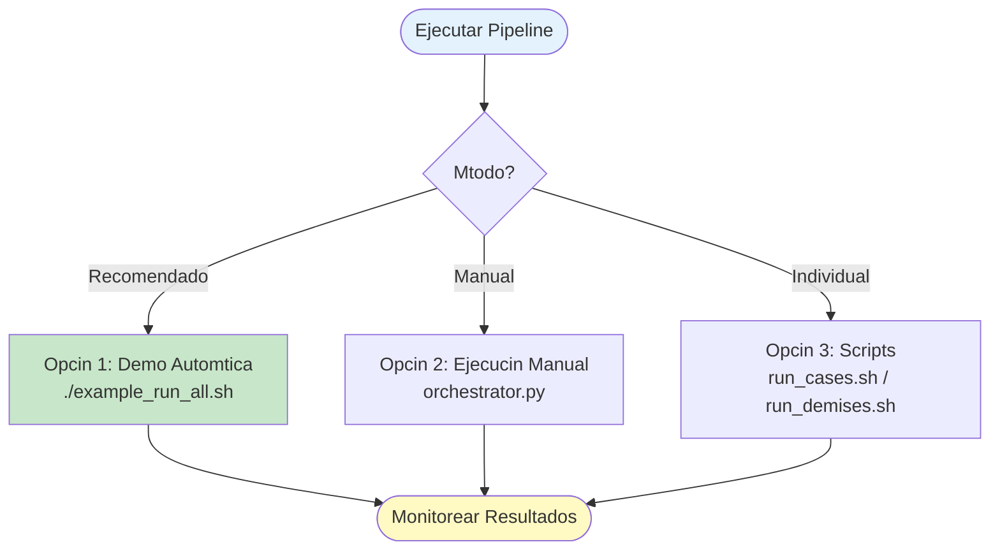
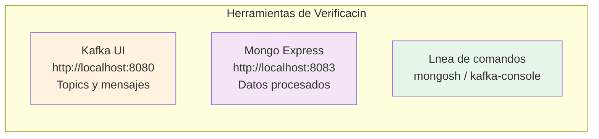
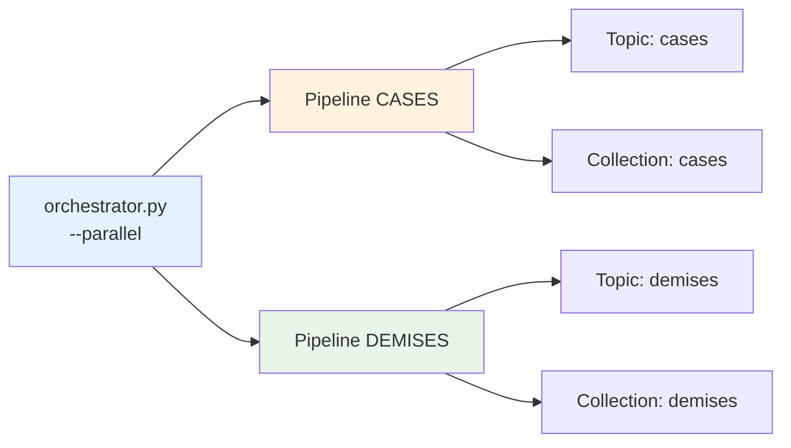
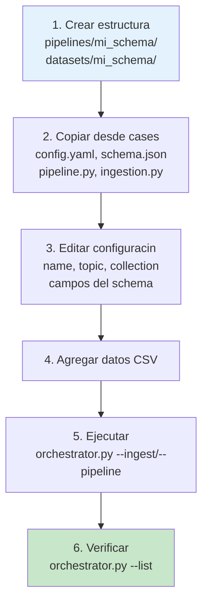
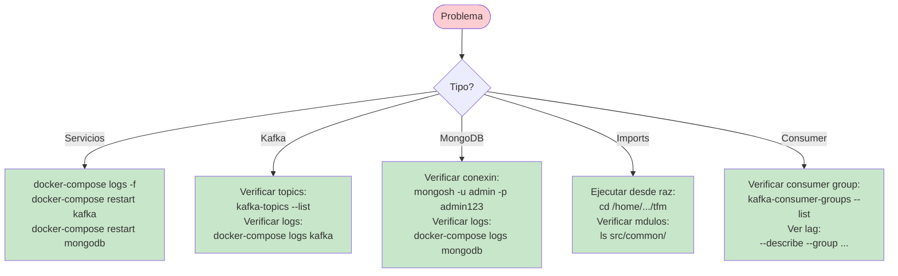
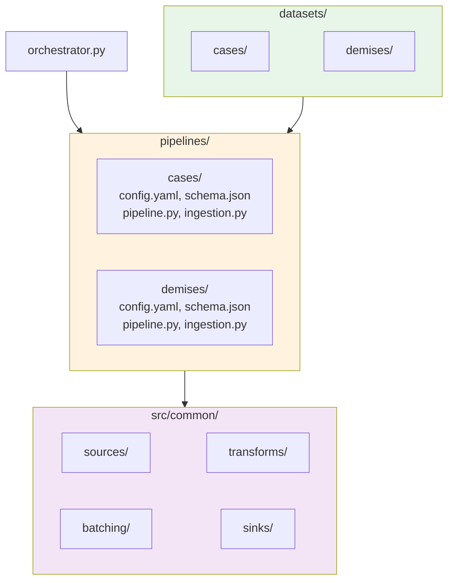

# Inicio Rpido - Pipeline Multi-Schema

## Instalacin


```bash
# 1. Instalar dependencias Python
pip install -r requirements.txt

# 2. Iniciar servicios Docker
docker-compose up -d

# 3. Verificar que los servicios estn corriendo
docker-compose ps
```

---

## Ejecucin Rpida

### Opciones de Ejecucin



### Opcin 1: Demo Automtica (Recomendado)

```bash
./example_run_all.sh
```

Este script:
- Verifica servicios
- Lista schemas disponibles
- Ingesta datos de CASES y DEMISES
- Ejecuta ambos pipelines
- Muestra URLs de monitoreo

### Opcin 2: Ejecucin Manual

```bash
# Ver schemas disponibles
python orchestrator.py --list

# Ingestar datos
python orchestrator.py --ingest cases
python orchestrator.py --ingest demises

# Ejecutar pipelines (en terminales separadas)
# Terminal 1:
python orchestrator.py --pipeline cases

# Terminal 2:
python orchestrator.py --pipeline demises
```

### Opcin 3: Scripts Individuales

```bash
# CASES
./run_cases.sh both      # Ingesta + Pipeline

# DEMISES
./run_demises.sh both    # Ingesta + Pipeline
```

---

## Verificar Resultados



### 1. Verificar Kafka (Topics y Mensajes)

Abrir http://localhost:8080 en el navegador.

O por lnea de comandos:
```bash
# Listar topics
docker exec -it $(docker-compose ps -q kafka) kafka-topics --list --bootstrap-server localhost:9092

# Ver mensajes del topic cases
docker exec -it $(docker-compose ps -q kafka) kafka-console-consumer --bootstrap-server localhost:9092 --topic cases --from-beginning --max-messages 5
```

### 2. Verificar MongoDB (Datos Procesados)

Abrir http://localhost:8083 en el navegador.
- Usuario: `admin`
- Password: `admin123`

O por lnea de comandos:
```bash
# Conectar a MongoDB
docker exec -it $(docker-compose ps -q mongodb) mongosh -u admin -p admin123

# En la shell de mongo:
use covid-db

# Contar documentos por coleccin
db.cases.countDocuments()
db.demises.countDocuments()
db.dead_letter_queue.countDocuments()

# Ver documentos de ejemplo
db.cases.find().limit(5).pretty()
db.demises.find().limit(5).pretty()

# Ver errores en DLQ (si hay)
db.dead_letter_queue.find().pretty()
```

### 3. Consultas tiles en MongoDB

```javascript
// Documentos por schema
db.cases.countDocuments()
db.demises.countDocuments()

// ltimos registros procesados
db.cases.find().sort({timestamp: -1}).limit(10)

// Errores en DLQ por schema
db.dead_letter_queue.aggregate([
  {$group: {
    _id: "$schema",
    error_count: {$sum: 1}
  }}
])

// Errores por tipo
db.dead_letter_queue.aggregate([
  {$group: {
    _id: "$error_type",
    count: {$sum: 1}
  }}
])
```

---

## Ejecucin en Paralelo



```bash
# Ingestar ambos schemas en paralelo
python orchestrator.py --ingest cases demises --parallel

# Ejecutar ambos pipelines en paralelo
python orchestrator.py --pipeline cases demises --parallel
```

---

## Agregar Tu Propio Schema



```bash
# 1. Crear estructura
mkdir -p pipelines/mi_schema
mkdir -p datasets/mi_schema

# 2. Copiar archivos desde cases
cp pipelines/cases/config.yaml pipelines/mi_schema/
cp pipelines/cases/schema.json pipelines/mi_schema/
cp pipelines/cases/pipeline.py pipelines/mi_schema/
cp pipelines/cases/ingestion.py pipelines/mi_schema/

# 3. Editar configuracin
# - pipelines/mi_schema/config.yaml: cambiar name, topic, collection
# - pipelines/mi_schema/schema.json: definir campos
# - pipelines/mi_schema/pipeline.py: cambiar CasesPipeline  MiSchemaPipeline
# - pipelines/mi_schema/ingestion.py: cambiar CasesIngestion  MiSchemaIngestion

# 4. Agregar datos
cp tus_datos.csv datasets/mi_schema/

# 5. Ejecutar
python orchestrator.py --ingest mi_schema
python orchestrator.py --pipeline mi_schema

# 6. Verificar
python orchestrator.py --list
```

---

## Comandos tiles

```bash
# Listar todos los schemas
python orchestrator.py --list

# Ingestar todos los schemas
python orchestrator.py --ingest-all

# Ejecutar todos los pipelines en paralelo
python orchestrator.py --pipeline-all --parallel

# Ingestar archivo especfico
python orchestrator.py --ingest cases --file mi_archivo.csv

# Ver logs en tiempo real
python orchestrator.py --pipeline cases 2>&1 | tee pipeline.log

# Detener servicios
docker-compose down

# Reiniciar servicios (limpiar datos)
docker-compose down -v
docker-compose up -d
```

---

## Troubleshooting



### Los servicios no inician

```bash
docker-compose logs -f
docker-compose restart kafka
docker-compose restart mongodb
```

### No se crean mensajes en Kafka

```bash
docker-compose ps kafka
docker-compose logs kafka
docker exec -it $(docker-compose ps -q kafka) kafka-topics --list --bootstrap-server localhost:9092
```

### No se escriben datos en MongoDB

```bash
docker-compose ps mongodb
docker-compose logs mongodb
docker exec -it $(docker-compose ps -q mongodb) mongosh -u admin -p admin123
```

### Error de importacin de mdulos

```bash
# Asegrate de estar en el directorio raz del proyecto
pwd  # Debe terminar en /tfm

# Verifica que existan los mdulos
ls src/common/
ls pipelines/cases/
```

### Pipeline no consume mensajes

```bash
# Verificar consumer group
docker exec -it $(docker-compose ps -q kafka) kafka-consumer-groups --bootstrap-server localhost:9092 --list

# Ver lag del consumer group
docker exec -it $(docker-compose ps -q kafka) kafka-consumer-groups --bootstrap-server localhost:9092 --describe --group beam-pipeline-cases
```

---

## Prximos Pasos

1. **Explorar los datos**: Abre Mongo Express y explora las colecciones
2. **Personalizar configuracin**: Edita `pipelines/cases/config.yaml`
3. **Agregar un schema**: Crea tu propio schema siguiendo los pasos anteriores
4. **Monitorear en tiempo real**: Usa Kafka UI para ver los mensajes
5. **Revisar errores**: Consulta la coleccin `dead_letter_queue`

## Recursos

- **README_NEW.md**: Documentacin completa
- **ARCHITECTURE.md**: Detalles de la arquitectura
- **Kafka UI**: http://localhost:8080
- **Mongo Express**: http://localhost:8083

## Estructura del Proyecto



Cada schema es completamente independiente y puede ejecutarse en paralelo sin afectar a los dems.
