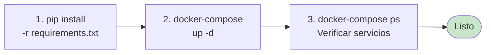
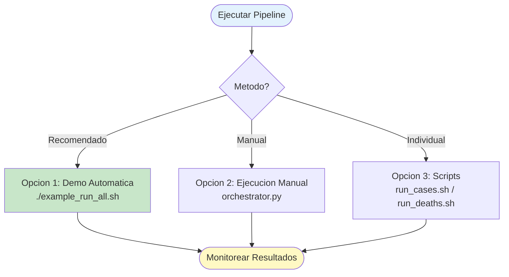
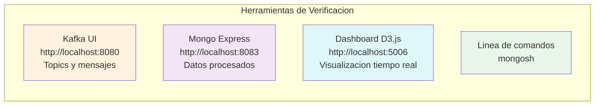
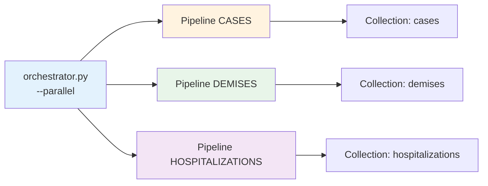

# Inicio Rapido - Pipeline Multi-Schema

## Instalacion



```bash
# 1. Instalar dependencias Python
pip install -r requirements.txt

# 2. Iniciar servicios Docker (Kafka KRaft + MongoDB + UIs)
docker-compose up -d

# 3. Verificar que los servicios esten corriendo
docker-compose ps
```

---

## Ejecucion Rapida

### Opciones de Ejecucion



### Opcion 1: Demo Automatica (Recomendado)

```bash
./example_run_all.sh
```

Este script:
- Verifica servicios
- Lista schemas disponibles (cases, demises, hospitalizations)
- Ingesta datos de los 3 schemas
- Ejecuta los pipelines
- Muestra URLs de monitoreo

### Opcion 2: Ejecucion Manual

```bash
# Ver schemas disponibles
python orchestrator.py --list

# Ingestar datos
python orchestrator.py --ingest cases
python orchestrator.py --ingest demises
python orchestrator.py --ingest hospitalizations

# Ejecutar pipelines (en terminales separadas)
# Terminal 1:
python orchestrator.py --pipeline cases

# Terminal 2:
python orchestrator.py --pipeline demises

# Terminal 3:
python orchestrator.py --pipeline hospitalizations
```

### Opcion 3: Scripts Individuales

```bash
# CASES
./run_cases.sh both      # Ingesta + Pipeline

# DEMISES
./run_deaths.sh both     # Ingesta + Pipeline
```

---

## Verificar Resultados



### 1. Verificar Kafka (Topics y Mensajes)

Abrir http://localhost:8080 en el navegador.

O por linea de comandos:
```bash
# Listar topics
docker exec kafka-kraft kafka-topics.sh --list --bootstrap-server localhost:9092
```

### 2. Verificar MongoDB (Datos Procesados)

Abrir http://localhost:8083 en el navegador.

O por linea de comandos:
```bash
docker exec -it mongodb mongosh -u admin -p admin123

# En la shell de mongo:
use covid-db

# Contar documentos por coleccion
db.cases.countDocuments()
db.demises.countDocuments()
db.hospitalizations.countDocuments()
db.dead_letter_queue.countDocuments()

# Ver documentos de ejemplo
db.cases.find().limit(5).pretty()
db.demises.find().limit(5).pretty()
db.hospitalizations.find().limit(5).pretty()
```

### 3. Dashboard en Tiempo Real

```bash
cd visualization
pip install flask flask-socketio flask-cors pymongo
python app.py
# Abrir http://localhost:5006
```

### 4. Consultas Utiles en MongoDB

```javascript
// Documentos por schema
db.cases.countDocuments()
db.demises.countDocuments()
db.hospitalizations.countDocuments()

// Ultimos registros procesados
db.cases.find().sort({timestamp: -1}).limit(10)

// Errores en DLQ por schema
db.dead_letter_queue.aggregate([
  {$group: {
    _id: "$schema",
    error_count: {$sum: 1}
  }}
])
```

---

## Ejecucion en Paralelo



```bash
# Ingestar todos los schemas en paralelo
python orchestrator.py --ingest-all --parallel

# Ejecutar todos los pipelines en paralelo
python orchestrator.py --pipeline-all --parallel
```

---

## Agregar Tu Propio Schema

```bash
# 1. Crear estructura
mkdir -p pipelines/mi_schema
mkdir -p datasets/mi_schema

# 2. Copiar archivos desde cases
cp pipelines/cases/config.yaml pipelines/mi_schema/
cp pipelines/cases/cases.json pipelines/mi_schema/mi_schema.json
cp pipelines/cases/pipeline.py pipelines/mi_schema/
cp pipelines/cases/ingestion.py pipelines/mi_schema/

# 3. Editar configuracion
# - pipelines/mi_schema/config.yaml: cambiar name, topic, collection
# - pipelines/mi_schema/mi_schema.json: definir campos
# - pipelines/mi_schema/pipeline.py: cambiar CasesPipeline -> MiSchemaPipeline
# - pipelines/mi_schema/ingestion.py: cambiar CasesIngestion -> MiSchemaIngestion

# 4. Agregar datos
cp tus_datos.csv datasets/mi_schema/

# 5. Ejecutar
python orchestrator.py --ingest mi_schema
python orchestrator.py --pipeline mi_schema

# 6. Verificar
python orchestrator.py --list
```

---

## Comandos Utiles

```bash
# Listar todos los schemas
python orchestrator.py --list

# Ingestar todos los schemas
python orchestrator.py --ingest-all --parallel

# Ejecutar todos los pipelines en paralelo
python orchestrator.py --pipeline-all --parallel

# Ingestar archivo especifico
python orchestrator.py --ingest cases --file datasets/cases/file_0_cases.csv

# Ver logs en tiempo real
python orchestrator.py --pipeline cases 2>&1 | tee pipeline.log

# Detener servicios
docker-compose down

# Reiniciar servicios (limpiar datos)
docker-compose down -v
docker-compose up -d
```

---

## Troubleshooting

### Los servicios no inician

```bash
docker-compose logs -f
docker-compose restart kafka
docker-compose restart mongodb
```

### No se crean mensajes en Kafka

```bash
docker-compose ps
docker-compose logs kafka
docker exec kafka-kraft kafka-topics.sh --list --bootstrap-server localhost:9092
```

### No se escriben datos en MongoDB

```bash
docker exec -it mongodb mongosh -u admin -p admin123
use covid-db
db.cases.countDocuments()
db.dead_letter_queue.find().pretty()
```

### Error de importacion de modulos

```bash
# Asegurate de estar en el directorio raiz del proyecto
pwd  # Debe ser tfm-dataflow-architecture/
ls src/common/
ls pipelines/cases/
```

---

## Recursos

- **README.md**: Documentacion completa
- **ARCHITECTURE.md**: Detalles de la arquitectura
- **GUIA_NUEVO_SCHEMA.md**: Guia para agregar schemas
- **Kafka UI**: http://localhost:8080
- **Mongo Express**: http://localhost:8083
- **Dashboard**: http://localhost:5006

---

**Ultima actualizacion:** 2026-02-10
