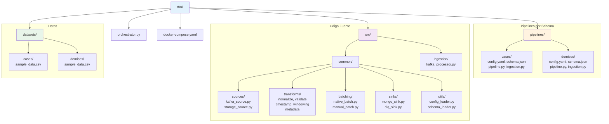
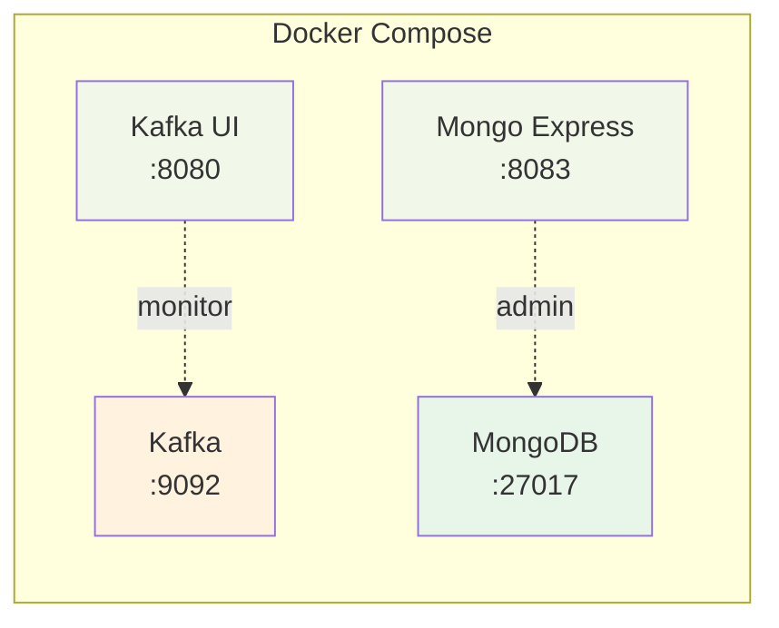
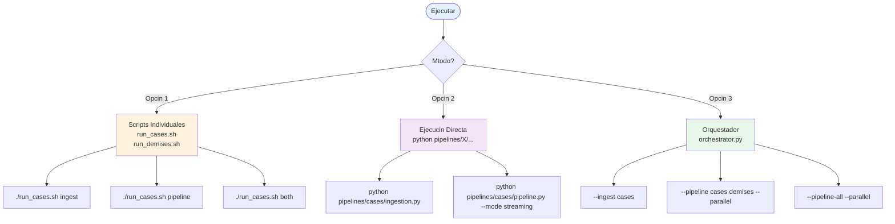
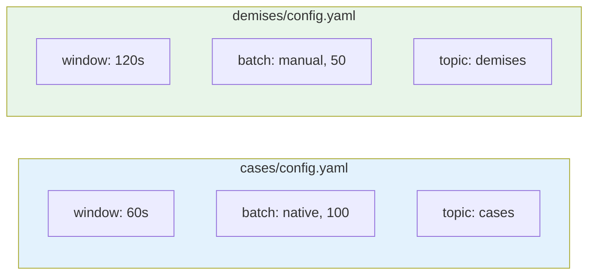
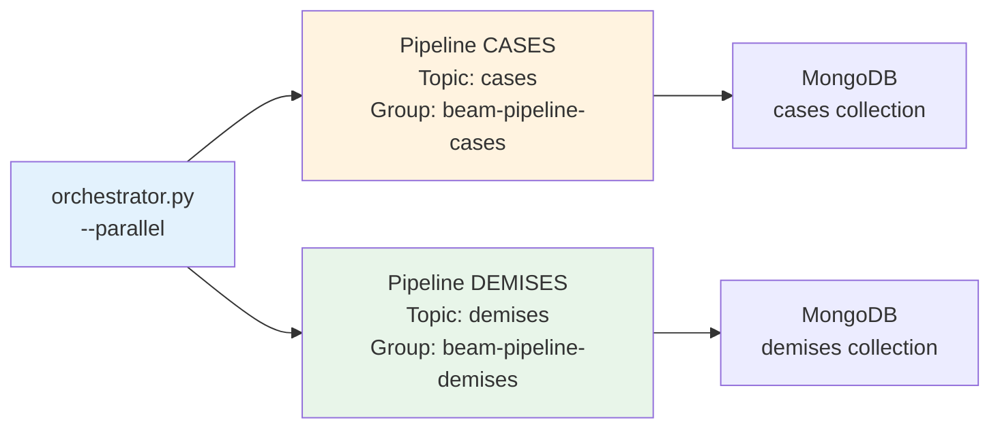
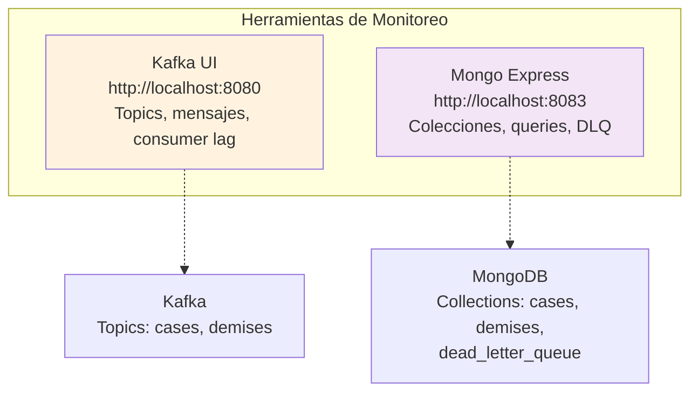
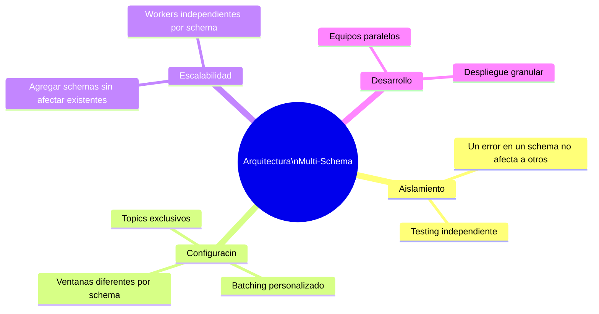
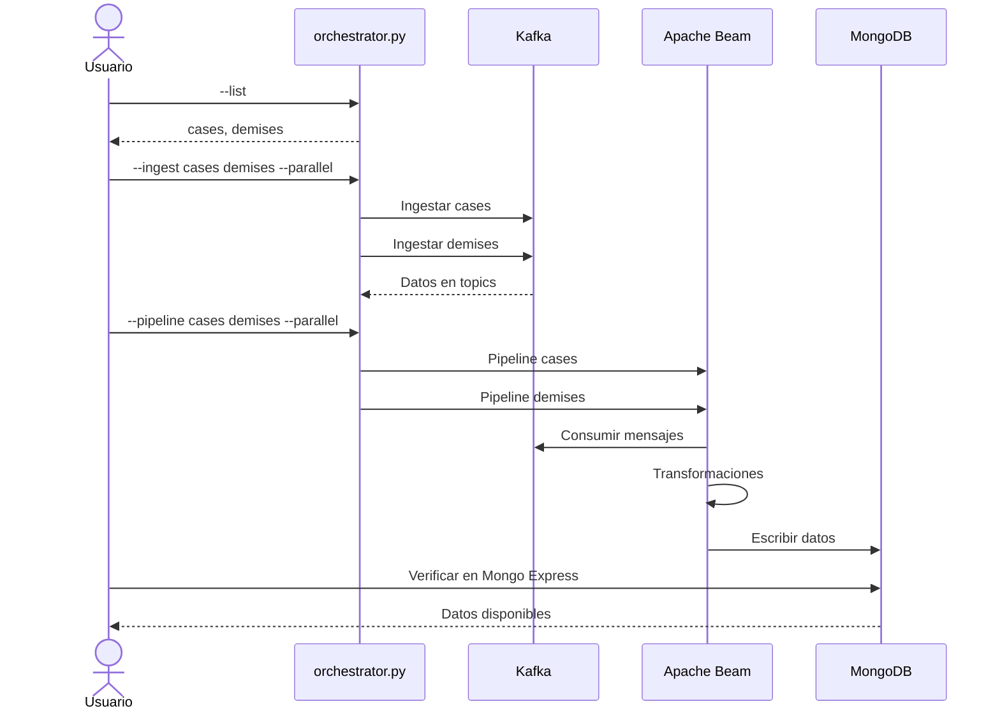
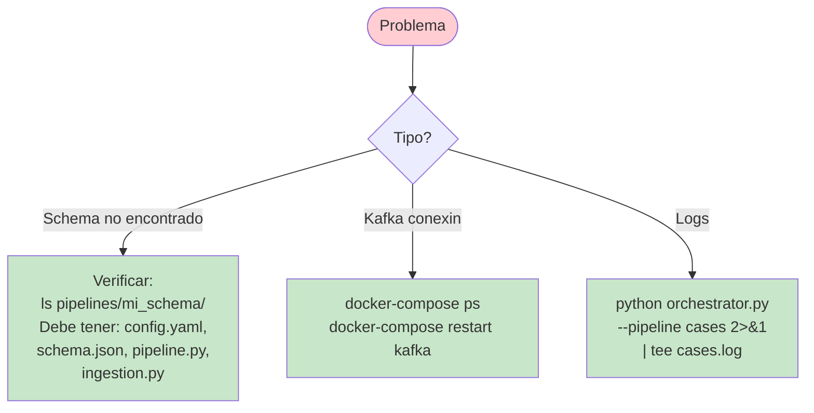

# Pipeline de Procesamiento Multi-Schema con Apache Beam

Arquitectura de procesamiento de datos en tiempo real usando Apache Beam, Confluent Kafka y MongoDB con time series collections. **Cada schema se procesa de manera completamente independiente.**

## Arquitectura

```mermaid
flowchart TB
    subgraph Cases["SCHEMA: CASES"]
        CSV1["CSV Files"] --> Kafka1["Kafka Topic\ncases"]
        Kafka1 --> Beam1["Apache Beam Pipeline"]
        Beam1 --> Mongo1["MongoDB Collection\ncases (Time-Series)"]
    end

    subgraph Demises["SCHEMA: DEMISES"]
        CSV2["CSV Files"] --> Kafka2["Kafka Topic\ndemises"]
        Kafka2 --> Beam2["Apache Beam Pipeline"]
        Beam2 --> Mongo2["MongoDB Collection\ndemises (Time-Series)"]
    end

    subgraph NewSchema["SCHEMA: [TU SCHEMA]"]
        CSV3["CSV Files"] --> Kafka3["Kafka Topic\nmi_schema"]
        Kafka3 --> Beam3["Apache Beam Pipeline"]
        Beam3 --> Mongo3["MongoDB Collection\nmi_schema (Time-Series)"]
    end

    style Cases fill:#e3f2fd
    style Demises fill:#e8f5e9
    style NewSchema fill:#fff3e0
```



### Caractersticas Clave

- **Independencia por Schema**: Cada schema tiene su propio pipeline, configuracin y proceso
- **Ejecucin Paralela**: Mltiples schemas pueden procesarse simultneamente
- **Configuracin Aislada**: Cada schema puede tener diferentes ventanas, batching, etc.
- **Escalabilidad**: Agregar nuevos schemas es trivial

## Estructura del Proyecto



## Instalacin

### 1. Instalar dependencias

```bash
pip install -r requirements.txt
```

### 2. Iniciar servicios compartidos

```bash
docker-compose up -d
```



## Uso

### Opciones de Ejecucin



### Opcin 1: Scripts Individuales por Schema

```bash
# CASES
./run_cases.sh ingest      # Solo ingesta
./run_cases.sh pipeline    # Solo pipeline
./run_cases.sh both        # Ingesta + pipeline

# DEMISES
./run_demises.sh ingest
./run_demises.sh pipeline
./run_demises.sh both
```

### Opcin 2: Ejecucin Directa

```bash
# Ejecutar ingesta de cases
python pipelines/cases/ingestion.py

# Ejecutar pipeline de cases (streaming desde Kafka)
python pipelines/cases/pipeline.py --mode streaming

# Ejecutar pipeline de cases (batch desde archivos)
python pipelines/cases/pipeline.py --mode batch

# Ejecutar ingesta de demises
python pipelines/demises/ingestion.py

# Ejecutar pipeline de demises
python pipelines/demises/pipeline.py --mode streaming
```

### Opcin 3: Orquestador (Recomendado para mltiples schemas)

```bash
# Listar schemas disponibles
python orchestrator.py --list

# Ejecutar pipeline de un schema
python orchestrator.py --pipeline cases

# Ejecutar ingesta de un schema
python orchestrator.py --ingest cases

# Ejecutar mltiples pipelines EN PARALELO
python orchestrator.py --pipeline cases demises --parallel

# Ejecutar TODOS los pipelines en paralelo
python orchestrator.py --pipeline-all --parallel

# Ejecutar TODAS las ingests en paralelo
python orchestrator.py --ingest-all --parallel

# Ingestar archivo especfico
python orchestrator.py --ingest cases --file datasets/cases/data.csv
```

## Agregar un Nuevo Schema

### Proceso


### Opcin 1: Manual

1. **Crear directorio del schema**

```bash
mkdir -p pipelines/mi_schema
mkdir -p datasets/mi_schema
```

2. **Copiar plantilla desde un schema existente**

```bash
cp pipelines/cases/config.yaml pipelines/mi_schema/
cp pipelines/cases/schema.json pipelines/mi_schema/
cp pipelines/cases/pipeline.py pipelines/mi_schema/
cp pipelines/cases/ingestion.py pipelines/mi_schema/
```

3. **Editar archivos**

`pipelines/mi_schema/config.yaml`:
```yaml
schema:
  name: "mi_schema"
  version: "1.0.0"
  description: "Pipeline para mi schema"

source:
  kafka:
    topic: "mi_schema"
    consumer_config:
      group.id: "beam-pipeline-mi_schema"
  storage:
    file_pattern: "datasets/mi_schema/*.csv"

# ... resto de configuracin
```

`pipelines/mi_schema/schema.json`:
```json
{
  "schema_name": "mi_schema",
  "required_fields": ["id", "timestamp"],
  "field_types": {
    "id": "string",
    "timestamp": "number"
  }
}
```

4. **Actualizar nombres de clases en pipeline.py e ingestion.py**

```python
# En pipeline.py
class MiSchemaPipeline:
    """Pipeline para procesar datos de MI_SCHEMA"""
    ...

# En ingestion.py
class MiSchemaIngestion:
    """Ingesta de datos para el schema MI_SCHEMA"""
    ...
```

5. **Crear script de ejecucin (opcional)**

```bash
cp run_cases.sh run_mi_schema.sh
# Editar y cambiar referencias de CASES a MI_SCHEMA
chmod +x run_mi_schema.sh
```

6. **Agregar datos**

```bash
# Colocar archivos CSV/Parquet en datasets/mi_schema/
cp mi_data.csv datasets/mi_schema/
```

7. **Ejecutar**

```bash
python orchestrator.py --ingest mi_schema
python orchestrator.py --pipeline mi_schema
```

## Configuracin Independiente por Schema

Cada schema puede tener configuracin completamente diferente:



**Ejemplo: cases/config.yaml**
```yaml
windowing:
  window_size_seconds: 60      # Ventanas de 1 minuto
batching:
  strategy: "native"           # Batching nativo
  batch_size: 100
```

**Ejemplo: demises/config.yaml**
```yaml
windowing:
  window_size_seconds: 120     # Ventanas de 2 minutos (diferente!)
batching:
  strategy: "manual"           # Batching manual (diferente!)
  batch_size: 50               # Batches ms pequeos (diferente!)
```

## Ejecucin en Paralelo



Para procesar mltiples schemas simultneamente:

```bash
# Terminal 1: Ingestar todos los schemas en paralelo
python orchestrator.py --ingest-all --parallel

# Terminal 2: Ejecutar todos los pipelines en paralelo
python orchestrator.py --pipeline-all --parallel
```

O ejecutar schemas especficos en paralelo:

```bash
python orchestrator.py --pipeline cases demises --parallel
```

## Monitoreo



### Kafka UI
- URL: http://localhost:8080
- Ver topics por schema: `cases`, `demises`, etc.

### Mongo Express
- URL: http://localhost:8083
- Usuario: admin
- Password: admin123
- Colecciones: `cases`, `demises`, `dead_letter_queue`

### Consultas MongoDB

```javascript
use("covid-db");

// Datos de cases
db.cases.find().limit(10);

// Datos de demises
db.demises.find().limit(10);

// Errores en DLQ por schema
db.dead_letter_queue.aggregate([
  {$group: {_id: "$schema", count: {$sum: 1}}}
]);
```

## Ventajas de esta Arquitectura



1. **Aislamiento Total**: Un error en un schema no afecta a otros
2. **Configuracin Flexible**: Cada schema puede tener diferentes ventanas, batching, etc.
3. **Escalabilidad Horizontal**: Agregar schemas no afecta a los existentes
4. **Desarrollo Paralelo**: Mltiples equipos pueden trabajar en diferentes schemas
5. **Testing Independiente**: Probar un schema no requiere los dems
6. **Despliegue Granular**: Actualizar un schema sin tocar otros

## Ejemplo de Flujo Completo



```bash
# 1. Ver schemas disponibles
python orchestrator.py --list

# 2. Ingestar datos de cases y demises en paralelo
python orchestrator.py --ingest cases demises --parallel

# 3. En otra terminal, ejecutar los pipelines en paralelo
python orchestrator.py --pipeline cases demises --parallel

# 4. Monitorear en Mongo Express
# Abrir http://localhost:8083

# 5. Agregar un nuevo schema
mkdir -p pipelines/recovered datasets/recovered
cp -r pipelines/cases/* pipelines/recovered/
# Editar pipelines/recovered/*

# 6. Ejecutar el nuevo schema
python orchestrator.py --ingest recovered
python orchestrator.py --pipeline recovered
```

## Troubleshooting



### Error: Schema no encontrado

```bash
# Verificar que existe el directorio
ls pipelines/

# Verificar que tiene los archivos necesarios
ls pipelines/mi_schema/
# Debe tener: config.yaml, schema.json, pipeline.py, ingestion.py
```

### Error: No se puede conectar a Kafka

```bash
# Verificar servicios
docker-compose ps

# Reiniciar servicios
docker-compose restart kafka
```

### Ver logs de un schema especfico

```bash
python orchestrator.py --pipeline cases 2>&1 | tee cases.log
```

## Prximos Pasos

- Configurar alertas por schema
- Agregar mtricas con Prometheus
- Implementar retry policies personalizadas
- Escalar con DataflowRunner en GCP
- Agregar tests por schema
