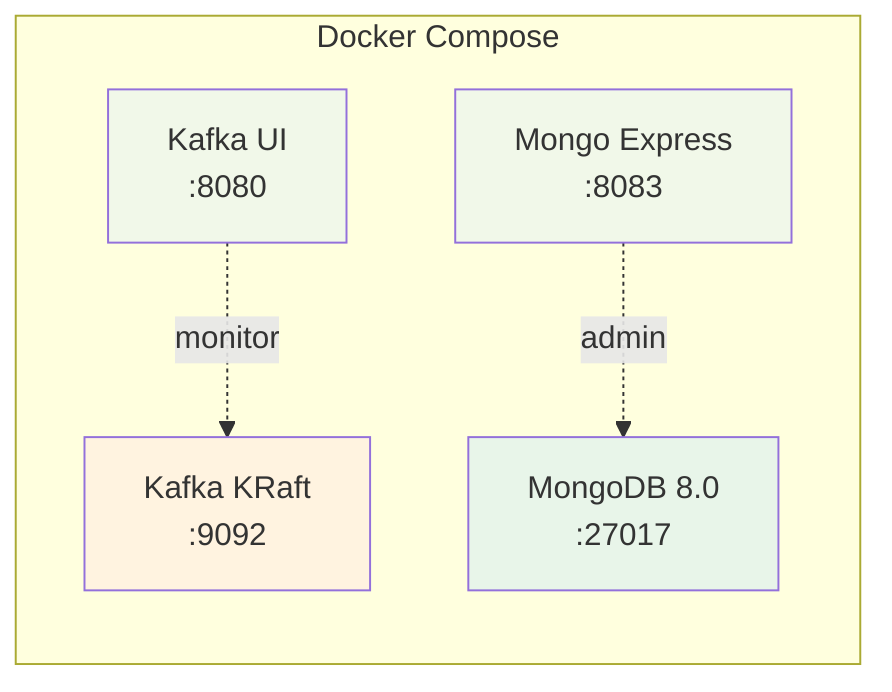
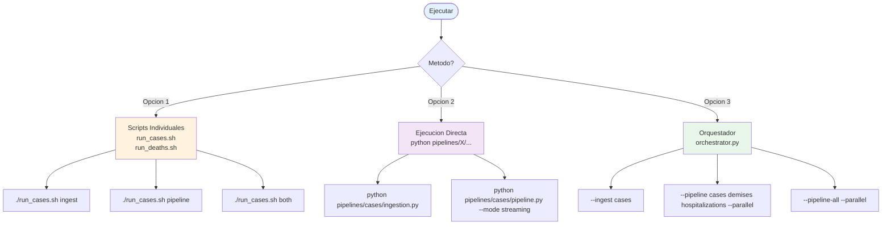
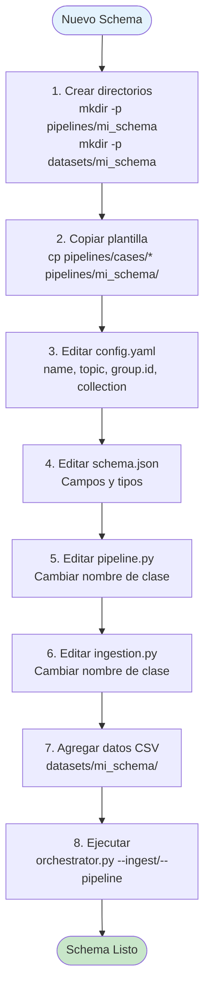
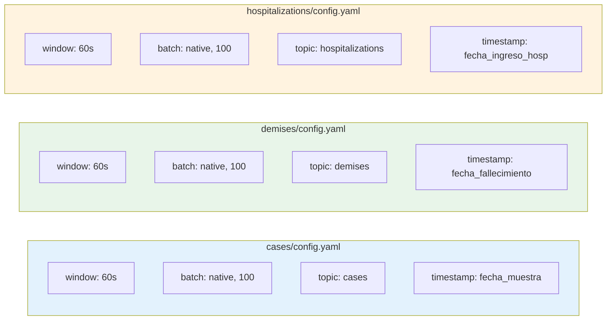
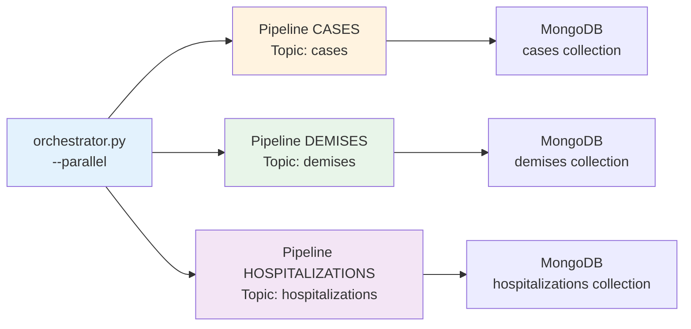
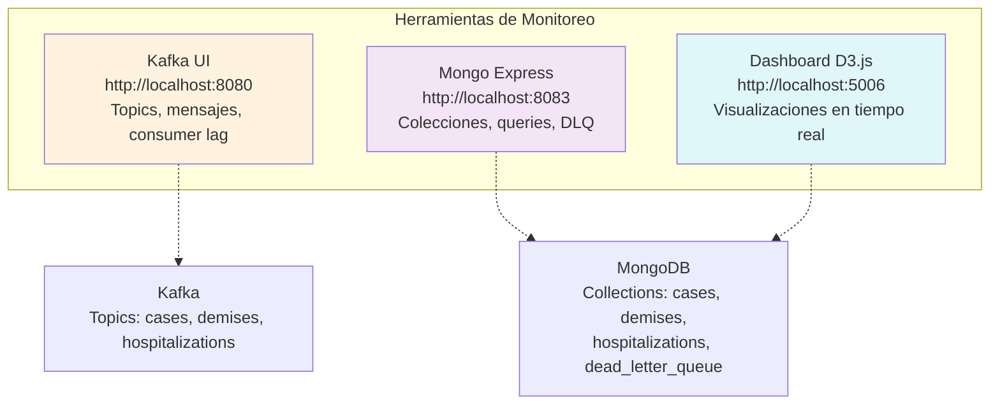
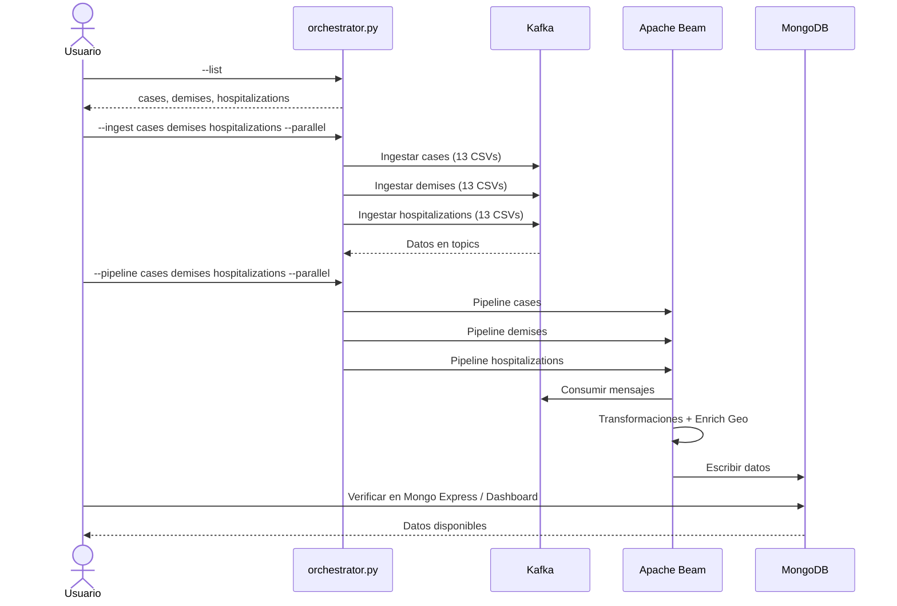

# Pipeline de Procesamiento Multi-Schema con Apache Beam

Arquitectura de procesamiento de datos en tiempo real usando Apache Beam, Confluent Kafka (KRaft) y MongoDB con time series collections. **Cada schema se procesa de manera completamente independiente.**

## Arquitectura

```mermaid
flowchart TB
    subgraph Cases["SCHEMA: CASES"]
        CSV1["CSV Files<br/>13 archivos"] --> Kafka1["Kafka Topic\ncases"]
        Kafka1 --> Beam1["Apache Beam Pipeline"]
        Beam1 --> Mongo1["MongoDB Collection\ncases (Time-Series)"]
    end

    subgraph Demises["SCHEMA: DEMISES"]
        CSV2["CSV Files<br/>13 archivos"] --> Kafka2["Kafka Topic\ndemises"]
        Kafka2 --> Beam2["Apache Beam Pipeline"]
        Beam2 --> Mongo2["MongoDB Collection\ndemises (Time-Series)"]
    end

    subgraph Hospitalizations["SCHEMA: HOSPITALIZATIONS"]
        CSV3["CSV Files<br/>13 archivos"] --> Kafka3["Kafka Topic\nhospitalizations"]
        Kafka3 --> Beam3["Apache Beam Pipeline"]
        Beam3 --> Mongo3["MongoDB Collection\nhospitalizations (Time-Series)"]
    end

    subgraph NewSchema["SCHEMA: [TU SCHEMA]"]
        CSV4["CSV Files"] --> Kafka4["Kafka Topic\nmi_schema"]
        Kafka4 --> Beam4["Apache Beam Pipeline"]
        Beam4 --> Mongo4["MongoDB Collection\nmi_schema (Time-Series)"]
    end

    style Cases fill:#e3f2fd
    style Demises fill:#e8f5e9
    style Hospitalizations fill:#fff3e0
    style NewSchema fill:#f3e5f5
```



### Caracteristicas Clave

- **Independencia por Schema**: Cada schema tiene su propio pipeline, configuracion y proceso
- **Ejecucion Paralela**: Multiples schemas pueden procesarse simultaneamente
- **Configuracion Aislada**: Cada schema puede tener diferentes ventanas, batching, etc.
- **Escalabilidad**: Agregar nuevos schemas es trivial
- **Enriquecimiento Geografico**: Coordenadas lat/lon desde codigos UBIGEO peruanos
- **Dashboard en Tiempo Real**: Visualizaciones D3.js + Leaflet en `visualization/`

## Estructura del Proyecto

```mermaid
flowchart TB
    Root["tfm-dataflow-architecture/"] --> Pipelines["pipelines/"]
    Root --> Src["src/"]
    Root --> Datasets["datasets/"]
    Root --> Viz["visualization/"]
    Root --> Orch["orchestrator.py"]
    Root --> Docker["docker-compose.yaml"]

    subgraph PipelinesDetail["Pipelines por Schema"]
        Pipelines --> Cases["cases/\nconfig.yaml, cases.json\npipeline.py, ingestion.py"]
        Pipelines --> Demises["demises/\nconfig.yaml, demises.json\npipeline.py, ingestion.py"]
        Pipelines --> Hospitals["hospitalizations/\nconfig.yaml, hospitalizations.json\npipeline.py, ingestion.py"]
    end

    subgraph SrcDetail["Codigo Fuente"]
        Src --> Common["common/"]
        Common --> Sources["sources/\nkafka_source_native.py\nstorage_source.py"]
        Common --> Transforms["transforms/\nnormalize, validate\ntimestamp, windowing\nmetadata, enrich_geo"]
        Common --> Batching["batching/\nnative_batch.py\nmanual_batch.py"]
        Common --> Sinks["sinks/\nmongo_sink.py\ndlq_sink.py"]
        Common --> Utils["utils/\nconfig_loader.py\nschema_loader.py"]
        Common --> Data["data/\nubigeo_coords.py"]
        Src --> Ingestion["ingestion/\nkafka_processor.py"]
    end

    subgraph DatasetsDetail["Datos"]
        Datasets --> DCases["cases/\n13 archivos CSV"]
        Datasets --> DDemises["demises/\n13 archivos CSV"]
        Datasets --> DHospital["hospitalizations/\n13 archivos CSV"]
    end

    subgraph VizDetail["Visualizacion"]
        Viz --> VizApp["Flask + Socket.IO\nD3.js + Leaflet\nPort: 5006"]
    end

    style Root fill:#e3f2fd
    style Pipelines fill:#fff3e0
    style Src fill:#f3e5f5
    style Datasets fill:#e8f5e9
    style Viz fill:#e0f7fa
```



## Instalacion

### 1. Instalar dependencias

```bash
pip install -r requirements.txt
```

### 2. Iniciar servicios compartidos

```bash
docker-compose up -d
```



> **Nota**: Kafka usa modo KRaft (sin Zookeeper). El cluster se auto-configura.

## Uso

### Opciones de Ejecucion



### Opcion 1: Scripts Individuales por Schema

```bash
# CASES
./run_cases.sh ingest      # Solo ingesta
./run_cases.sh pipeline    # Solo pipeline
./run_cases.sh both        # Ingesta + pipeline

# DEMISES
./run_deaths.sh ingest
./run_deaths.sh pipeline
./run_deaths.sh both
```

### Opcion 2: Ejecucion Directa

```bash
# Ejecutar ingesta de cases
python pipelines/cases/ingestion.py

# Ejecutar pipeline de cases (streaming desde Kafka)
python pipelines/cases/pipeline.py --mode streaming

# Ejecutar pipeline de cases (batch desde archivos)
python pipelines/cases/pipeline.py --mode batch

# Ejecutar ingesta de demises
python pipelines/demises/ingestion.py

# Ejecutar pipeline de demises
python pipelines/demises/pipeline.py --mode streaming

# Ejecutar ingesta de hospitalizations
python pipelines/hospitalizations/ingestion.py

# Ejecutar pipeline de hospitalizations
python pipelines/hospitalizations/pipeline.py --mode streaming
```

### Opcion 3: Orquestador (Recomendado para multiples schemas)

```bash
# Listar schemas disponibles
python orchestrator.py --list

# Ejecutar pipeline de un schema
python orchestrator.py --pipeline cases

# Ejecutar ingesta de un schema
python orchestrator.py --ingest cases

# Ejecutar multiples pipelines EN PARALELO
python orchestrator.py --pipeline cases demises hospitalizations --parallel

# Ejecutar TODOS los pipelines en paralelo
python orchestrator.py --pipeline-all --parallel

# Ejecutar TODAS las ingests en paralelo
python orchestrator.py --ingest-all --parallel

# Ingestar archivo especifico
python orchestrator.py --ingest cases --file datasets/cases/file_0_cases.csv
```

## Agregar un Nuevo Schema

### Proceso



### Pasos Detallados

1. **Crear directorio del schema**

```bash
mkdir -p pipelines/mi_schema
mkdir -p datasets/mi_schema
```

2. **Copiar plantilla desde un schema existente**

```bash
cp pipelines/cases/config.yaml pipelines/mi_schema/
cp pipelines/cases/cases.json pipelines/mi_schema/mi_schema.json
cp pipelines/cases/pipeline.py pipelines/mi_schema/
cp pipelines/cases/ingestion.py pipelines/mi_schema/
```

3. **Editar archivos**

`pipelines/mi_schema/config.yaml`:
```yaml
schema:
  name: "mi_schema"
  version: "1.0.0"
  description: "Pipeline para mi schema"

source:
  kafka:
    topic: "mi_schema"
    consumer_config:
      group.id: "beam-pipeline-mi_schema"
  storage:
    file_pattern: "datasets/mi_schema/*.csv"
```

`pipelines/mi_schema/mi_schema.json`:
```json
{
  "schema_name": "mi_schema",
  "required_fields": ["id", "timestamp"],
  "field_types": {
    "id": "string",
    "timestamp": "number"
  }
}
```

4. **Actualizar nombres de clases en pipeline.py e ingestion.py**

```python
# En pipeline.py
class MiSchemaPipeline:
    """Pipeline para procesar datos de MI_SCHEMA"""
    ...

# En ingestion.py
class MiSchemaIngestion:
    """Ingesta de datos para el schema MI_SCHEMA"""
    ...
```

5. **Agregar datos y ejecutar**

```bash
cp tus_datos.csv datasets/mi_schema/
python orchestrator.py --ingest mi_schema
python orchestrator.py --pipeline mi_schema
```

## Configuracion Independiente por Schema

Cada schema puede tener configuracion completamente diferente:



## Ejecucion en Paralelo



```bash
# Ingestar todos los schemas en paralelo
python orchestrator.py --ingest-all --parallel

# Ejecutar todos los pipelines en paralelo
python orchestrator.py --pipeline-all --parallel
```

## Monitoreo



### Kafka UI
- URL: http://localhost:8080
- Ver topics por schema: `cases`, `demises`, `hospitalizations`

### Mongo Express
- URL: http://localhost:8083
- Colecciones: `cases`, `demises`, `hospitalizations`, `dead_letter_queue`

### Dashboard D3.js
- URL: http://localhost:5006
- Visualizaciones en tiempo real con WebSockets
- Mapas de calor geograficos con Leaflet

### Consultas MongoDB

```javascript
use("covid-db");

// Datos de cases
db.cases.find().limit(10);

// Datos de demises
db.demises.find().limit(10);

// Datos de hospitalizations
db.hospitalizations.find().limit(10);

// Errores en DLQ por schema
db.dead_letter_queue.aggregate([
  {$group: {_id: "$schema", count: {$sum: 1}}}
]);
```

## Ejemplo de Flujo Completo



```bash
# 1. Ver schemas disponibles
python orchestrator.py --list

# 2. Ingestar datos en paralelo
python orchestrator.py --ingest-all --parallel

# 3. Ejecutar pipelines en paralelo
python orchestrator.py --pipeline-all --parallel

# 4. Monitorear en Mongo Express
# Abrir http://localhost:8083

# 5. Ver dashboard en tiempo real
cd visualization && python app.py
# Abrir http://localhost:5006
```

## Troubleshooting

### Error: Schema no encontrado

```bash
# Verificar que existe el directorio
ls pipelines/

# Verificar que tiene los archivos necesarios
ls pipelines/mi_schema/
# Debe tener: config.yaml, {schema}.json, pipeline.py, ingestion.py
```

### Error: No se puede conectar a Kafka

```bash
docker-compose ps
docker-compose restart kafka
docker-compose logs kafka
```

### Ver logs de un schema especifico

```bash
python orchestrator.py --pipeline cases 2>&1 | tee cases.log
```

---

**Ultima actualizacion:** 2026-02-10
**Version:** 2.0.0
